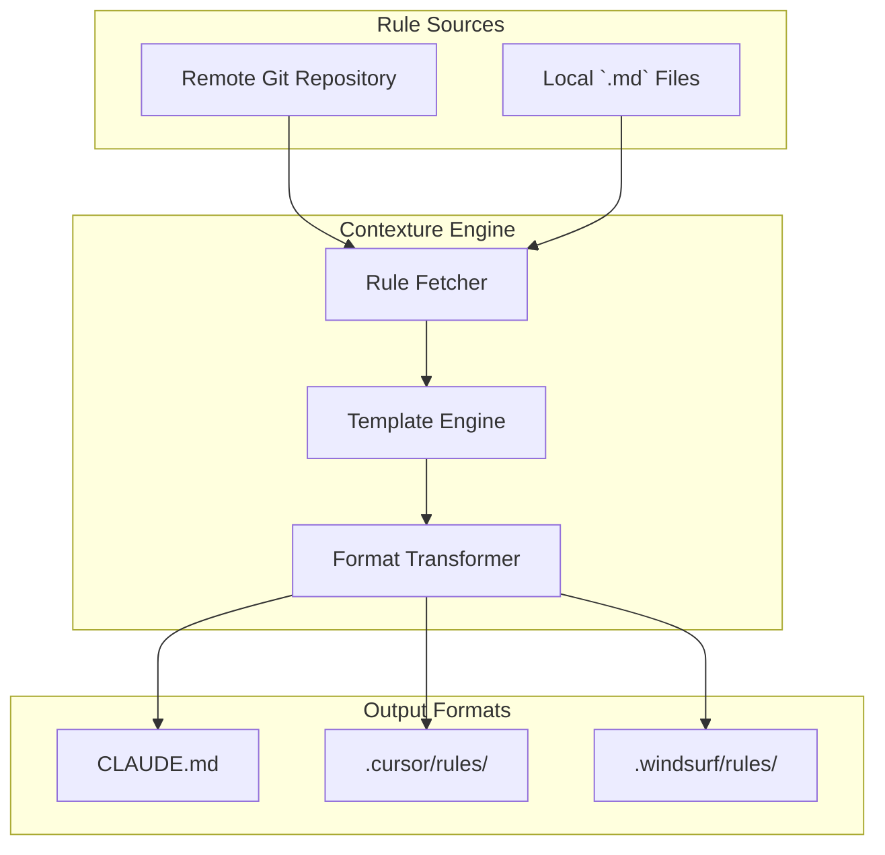

# Contexture

`contexture` is a command-line tool for managing AI assistant instructions. It provides a centralized system for organizing, versioning, and deploying rules to multiple platforms and formats, including Claude, Cursor, and Windsurf.

## Key Features

-   **Multi-Format Output**: Generates platform-specific files for Claude (`CLAUDE.md`), Cursor (`.cursor/rules/`), and Windsurf (`.windsurf/rules/`).
-   **Rule Sourcing**: Fetches rules from local files and remote Git repositories.
-   **Template Engine**: Customizes rules with variables using Go's `text/template` syntax.
-   **CLI**: Manages rules and project configuration via a command-line interface.

## Architecture



## Installation

### Go Install

```bash
go install github.com/contextureai/contexture/cmd/contexture@latest
```

### From Source

```bash
git clone https://github.com/contextureai/contexture.git
cd contexture
make build
# The binary is available at ./bin/contexture
```

### Verification

```bash
contexture --version
```

## Quick Start

### 1. Initialize Project

Navigate to a project directory and run `init`.

```bash
contexture init
```

This creates a `.contexture.yaml` file.

```yaml
version: 1
formats:
  - type: claude
    enabled: true
  - type: cursor
    enabled: true
  - type: windsurf
    enabled: false
rules: []
```

### 2. Add Rules

Add rules directly by specifying their IDs.

```bash
# Add rules using simple format
contexture rules add languages/go/code-organization testing/unit-tests

# Add specific rules by ID
contexture rules add "[contexture:code/clean-code]" "[contexture:docs/readme-best-practices]"

# Add rules using @provider syntax
contexture rules add "@mycompany/security/auth"
```

### 3. Generate Output Files

Run `build` to generate the format-specific files.

```bash
contexture build
```

This creates:
-   `CLAUDE.md`
-   `.cursor/rules/`
-   `.windsurf/rules/`

## Core Concepts

### Rules

Rules are Markdown documents with YAML frontmatter.

```markdown
---
title: Clean Code Principles
description: Guidelines for writing maintainable code.
tags: [code-quality, best-practices]
trigger: manual
variables:
  maxLineLength: 100
---

When writing code, keep functions small and focused.
Use meaningful variable names up to {{.maxLineLength}} characters.
```

### Formats

| Format     | Output                 | Description                               |
| :--------- | :--------------------- | :---------------------------------------- |
| `claude`   | `CLAUDE.md`            | A single file for the Claude AI assistant.  |
| `cursor`   | `.cursor/rules/*.md`   | Individual files for the Cursor IDE.      |
| `windsurf` | `.windsurf/rules/*.md` | Individual files for the Windsurf editor. |

### Variables

Rule content can be customized with variables defined in `.contexture.yaml`.

```yaml
# In .contexture.yaml
rules:
  - id: "[contexture:code/clean-code]"
    variables:
      maxLineLength: 120
```

## Commands

### Project

| Command                  | Description                                |
| :----------------------- | :----------------------------------------- |
| `init`                   | Initialize a new project.                  |
| `config` or `config show`  | Display the current project configuration. |
| `config formats add`     | Add one or more output formats.            |
| `config formats remove`  | Remove one or more output formats.         |
| `config formats enable`  | Enable one or more output formats.         |
| `config formats disable` | Disable one or more output formats.        |

### Rules

| Command                | Description                                                      |
| :--------------------- | :--------------------------------------------------------------- |
| `rules add`            | Add rules to the project.                                        |
| `rules remove`         | Remove rules from the project.                                   |
| `rules list`           | List all configured rules. Use `-o json` for structured output.  |
| `rules update`         | Update remote rules to their latest versions.                    |

### Providers

| Command              | Description                                        |
| :------------------- | :------------------------------------------------- |
| `providers list`     | List all configured providers.                     |
| `providers add`      | Add a new provider to the project.                 |
| `providers remove`   | Remove a provider from the project.                |
| `providers show`     | Show details for a specific provider.              |

### Build

| Command | Description                                   |
| :------ | :-------------------------------------------- |
| `build` | Generate output files for all enabled formats. |

## Configuration (`.contexture.yaml`)

```yaml
version: 1

# Defines custom named providers for sourcing rules.
providers:
  - name: mycompany
    url: https://github.com/my-org/contexture-rules.git
    defaultBranch: main

# Specifies which AI assistant formats to generate.
formats:
  - type: claude
    enabled: true
  - type: cursor
    enabled: true
  - type: windsurf
    enabled: false

# A list of rule references to include in the project.
rules:
  - id: "[contexture:code/clean-code]"
    variables:
      maxLineLength: 120
  - id: "@mycompany/team/deployment-process"

# Controls build behavior and performance.
generation:
  parallelFetches: 5
  defaultBranch: main
  cacheEnabled: true
  cacheTTL: "24h"
```

## Development

See the `Makefile` for available development commands.

-   `make deps`: Install dependencies.
-   `make test`: Run unit tests.
-   `make lint`: Run the linter.
-   `make build`: Build the binary.
-   `make integration`: Run integration tests.
-   `make e2e`: Run end-to-end tests.

## Contributing

Please see [CONTRIBUTING.md](CONTRIBUTING.md) for details.

## License

This project is licensed under the MIT License. See the [LICENSE](LICENSE) file for details.