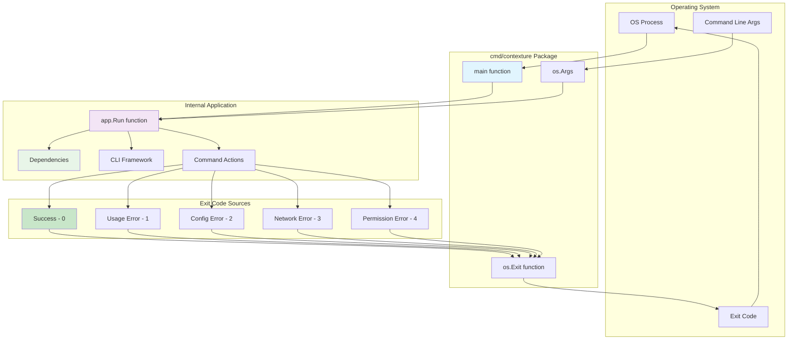
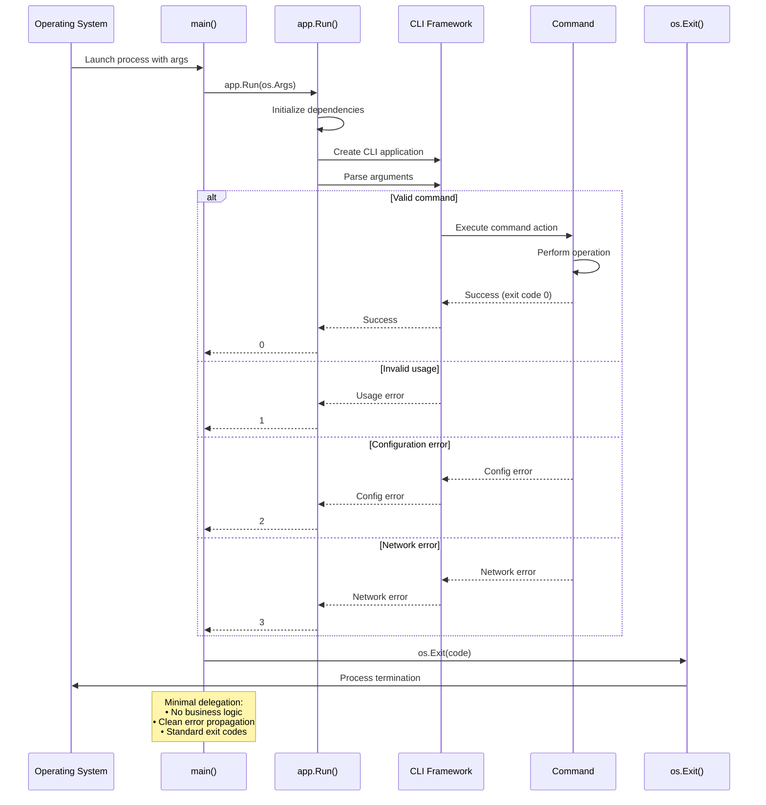

# CLI Entry Point

This package provides the main entry point for the CLI application. It serves as a minimal bootstrap that delegates all functionality to the internal application structure.

## Purpose

This package follows Go conventions for command-line applications by providing a clean entry point that:
- Initializes the application via the `internal/app` package.
- Handles process exit codes.
- Maintains separation between the CLI interface and the application logic.

### Bootstrap Architecture

### Execution Flow

### Build and Deployment Process

## Design Principles

- **Minimal Responsibility**: This package contains only the necessary bootstrap code.
- **Delegation**: All business logic is handled by internal packages.
- **Clean Exit Handling**: The application uses appropriate process exit codes for different scenarios.

## Usage

This package is built into the final `contexture` binary.