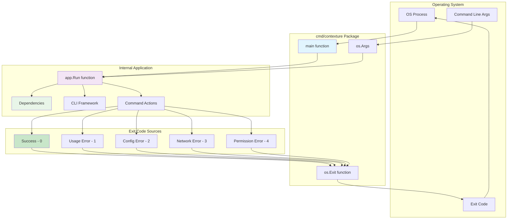
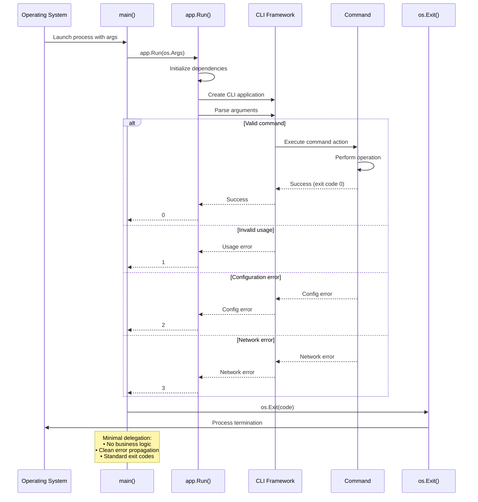
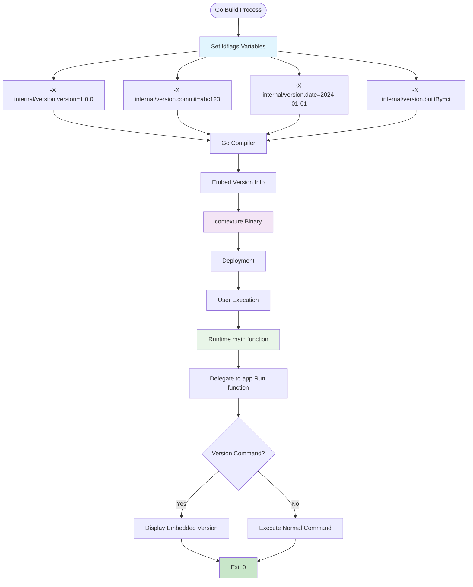

# Contexture CLI Entry Point

This package provides the main entry point for the Contexture CLI application. It serves as the minimal bootstrap that delegates to the internal application structure for all functionality.

## Purpose

The cmd/contexture package follows Go conventions for command-line applications by providing a clean entry point that:
- Initializes the application through the internal app package
- Handles process exit codes appropriately
- Maintains separation between the CLI interface and application logic

## Architecture

The package implements a minimal main function that:
1. Delegates all functionality to `internal/app.Run()`
2. Passes command-line arguments directly to the application
3. Exits with the appropriate status code based on execution results

### Bootstrap Architecture



### Execution Flow



### Build and Deployment Process



## Design Principles

- **Minimal Responsibility**: Contains only the necessary bootstrap code
- **Delegation Pattern**: All business logic is handled by internal packages
- **Clean Exit Handling**: Proper process exit codes for different scenarios
- **Go Conventions**: Follows standard Go project layout for CLI applications

## Files

- `main.go`: The application entry point with minimal bootstrap logic
- `main_test.go`: Basic tests for the main function behavior

## Usage

This package is built into the final `contexture` binary that users interact with. The binary can be invoked with various commands and flags:

```bash
contexture --help
contexture init
contexture rules add [rule-id]
contexture build
```

## Relationship to Internal Packages

The cmd package acts as the public interface that users interact with, while delegating all functionality to:
- **internal/app**: Application structure and CLI framework setup
- **internal/commands**: Individual command implementations
- **internal/dependencies**: Dependency injection and resource management

## Build Process

This package is the build target for creating the final CLI binary:
- Compiled to produce the `contexture` executable
- All internal packages are bundled into the final binary
- No external runtime dependencies required