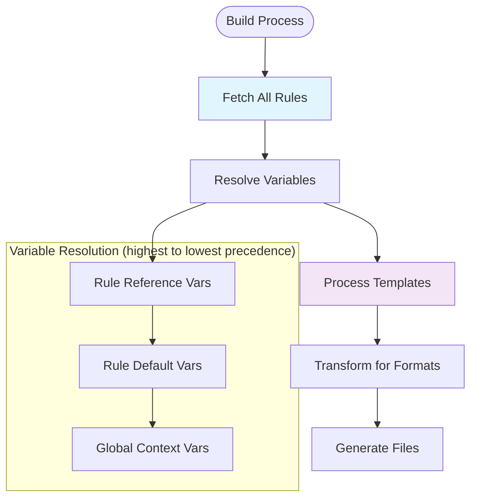

Rules are the core building blocks of `contexture`. They are markdown documents that contain the instructions for an AI assistant.

## Rule Anatomy

A rule consists of three parts: frontmatter, content, and optional variables.

```markdown
---
# 1. Frontmatter (YAML metadata)
title: Rule Title
description: A brief description of the rule.
tags: [tag1, tag2]
---

# 2. Content (Markdown body)
This is the instruction content that will be provided to the AI assistant.

# 3. Variables (Optional template variables)
Use {{.variableName}} for customization.
```

### Frontmatter

The frontmatter contains metadata that describes the rule.

```yaml
---
title: Clean Code Principles
description: Guidelines for writing maintainable and readable code.
tags: [code-quality, best-practices]
languages: [javascript, python, go]
trigger: always
variables:
  maxLineLength: 80
---
```

**Required Fields:**
-   `title`: A short, descriptive name.
-   `description`: A brief explanation of the rule's purpose.
-   `tags`: An array of categorization tags.

**Optional Fields:**
-   `languages`: A list of applicable programming languages.
-   `frameworks`: A list of applicable frameworks or libraries.
-   `trigger`: When the rule should be applied (see [Triggers](#rule-triggers)).
-   `variables`: Default values for template variables.

### Content

The content is standard markdown that contains the instructions for the AI assistant. It can include [variables](#variables) for dynamic content.

### Variables

Rules can include template variables for customization, using Go's `text/template` syntax.

```markdown
- Maximum line length: {{default_if_empty .maxLineLength "80"}}

{{if .useTypeScript}}
- Always use explicit types for function parameters.
{{end}}

{{range .requiredImports}}
- Import: `{{.}}`
{{end}}
```

## Rule Types

### Remote Rules

Remote rules are stored in Git repositories.

### Local Rules

Local rules are stored in the project's `rules/` directory.

```bash
# Create a local rule
mkdir -p rules
touch rules/project-specific.md

# Add the rule to the configuration
contexture rules add rules/project-specific.md
```

### Global Rules (User Rules)

Global rules are stored in your user-level configuration at `~/.contexture/.contexture.yaml` and are automatically included in all projects. This is useful for rules you want to apply universally across your work.

#### User Rules vs Project Rules

Contexture distinguishes between two types of rules:

- **User Rules**: Personal rules from global configuration (`~/.contexture/.contexture.yaml`)
  - Apply to all your projects automatically
  - Represent your personal preferences and workflow
  - Output to IDE-native user rules locations when supported
  - Never committed to version control

- **Project Rules**: Team-shared rules from project configuration (`.contexture.yaml`)
  - Specific to the project repository
  - Shared with all team members via version control
  - Output to project directories that get committed
  - Define team standards and project-specific guidelines

**IDE-Native User Rules Support:**

Modern IDEs support separating user rules from project rules:

- **Windsurf**: User rules → `~/.windsurf/global_rules.md`, Project rules → `.windsurf/rules/`
- **Claude**: User rules → `~/.claude/CLAUDE.md`, Project rules → `CLAUDE.md`
- **Cursor**: Configurable via `userRulesMode` in `.contexture.yaml` (defaults to including user rules in project)

This separation prevents git conflicts when developers have different personal preferences while maintaining consistent team standards.

#### Adding and Managing Global Rules

```bash
# Add a rule to global configuration
contexture rules add "@contexture/languages/go/context" --global

# Add with shorthand flag
contexture rules add "@contexture/testing/best-practices" -g

# Add with variables
contexture rules add "@contexture/code-style" -g --var maxLineLength=120

# Remove global rules
contexture rules remove "@contexture/languages/go/context" --global

# Update global rules
contexture rules update "@contexture/testing/best-practices" -g --var level=strict

# View global configuration
contexture config --global
```

#### Key Features

- **Shared Across Projects**: Global rules apply to all your projects automatically
- **Project Overrides**: Project-specific rules with the same ID override global rules
- **Lazy Initialization**: Global config is created automatically on first use of `-g` flag
- **Source Indicators**: Use `contexture rules list` to see both global and project rules with `[global]` or `[project]` tags
- **Variable Support**: Global rules can have their own variable values

#### When to Use Global Rules

**Good Candidates for Global Rules:**
- Code style and formatting preferences that apply to all your work
- Security and best practices rules you always want to follow
- Language-specific rules for languages you use consistently
- Common patterns and conventions your team/organization uses

**Better as Project Rules:**
- Framework-specific rules that only apply to certain projects
- Experimental or temporary rules you're trying out
- Rules with project-specific variable configurations
- Client or domain-specific requirements

#### Override Behavior

When you add a rule to both global and project configurations with the same ID:

```bash
# Global rule with default variable
contexture rules add "@contexture/logging" -g --var format=json

# Project override with different variable
contexture rules add "@contexture/logging" --var format=structured

# List will show: [project overrides global]
contexture rules list
```

The project version takes precedence during `contexture build`. When you remove the project rule, the global version is used again automatically.

**Important:** Rule IDs are normalized by path only (variables are ignored for override detection). This means:

```yaml
# Global config
rules:
  - id: "@contexture/go/context"
    variables: {style: "strict"}

# Project config
rules:
  - id: "@contexture/go/context"
    variables: {style: "relaxed"}
```

Result: The project rule **overrides** the global rule entirely (uses `style: "relaxed"`). If you want both strict and relaxed versions, use different rule IDs or paths.

#### Migration Guide

**Moving Project Rules to Global:**

1. Review your existing project rules:
   ```bash
   contexture rules list
   ```

2. Identify rules you want globally (see "When to Use Global Rules" above)

3. Add them to global config:
   ```bash
   contexture rules add "@contexture/security/input-validation" -g
   ```

4. Remove from project (optional):
   ```bash
   contexture rules remove "@contexture/security/input-validation"
   ```

5. Verify the global rule is applied:
   ```bash
   contexture rules list  # Should show [global]
   contexture build       # Should include global rule
   ```

**Moving Global Rules to Project:**

If a global rule doesn't fit a specific project, simply add a project-level override or remove it for that project context by not including it in the project configuration.

### Custom Source Rules

Rules can be sourced from custom Git repositories using the `--source` (or `--src`) flag.

```bash
# Add rules from a custom repository
contexture rules add "productivity/checks" --src https://github.com/mycompany/rules.git

# Add specific rules from custom sources
contexture rules add "security/auth" --src "git@github.com:company/rules.git" --ref "v2.0"
```

## Rule Triggers

Triggers control when a rule is applied.

-   **`manual`** (Default): The rule is only applied when explicitly included in the AI assistant context.
-   **`always`**: The rule is always included in the AI assistant context.
-   **`model`**: The rule is applied based on the AI model's decision.
-   **`glob`**: The rule is applied when file patterns match.
    ```yaml
    ---
    trigger:
      type: glob
      globs:
        - "*.test.js"
    ---
    ```

## Rule Resolution

When `contexture build` is run:
1.  All rules are fetched.
2.  Variables are resolved.
3.  Templates are processed.
4.  The output is transformed for each enabled format.



## Next Steps

-   **[Formats](./formats)**: How rules are transformed for different platforms.
-   **[Variables](./variables)**: Advanced variable usage and template functions.
-   **[Projects](./projects)**: Organizing rules within projects.
