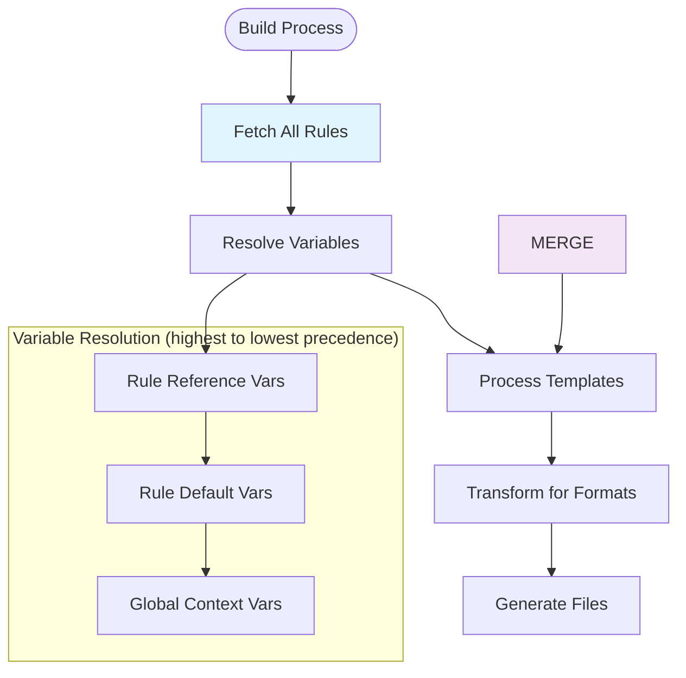

Rules are the core building blocks of `contexture`. They are markdown documents that contain the instructions for an AI assistant.

## Rule Anatomy

A rule consists of three parts: frontmatter, content, and optional variables.

```markdown
---
# 1. Frontmatter (YAML metadata)
title: Rule Title
description: A brief description of the rule.
tags: [tag1, tag2]
---

# 2. Content (Markdown body)
This is the instruction content that will be provided to the AI assistant.

# 3. Variables (Optional template variables)
Use {{.variableName}} for customization.
```

### Frontmatter

The frontmatter contains metadata that describes the rule.

```yaml
---
title: Clean Code Principles
description: Guidelines for writing maintainable and readable code.
tags: [code-quality, best-practices]
languages: [javascript, python, go]
trigger: always
variables:
  maxLineLength: 80
---
```

**Required Fields:**
-   `title`: A short, descriptive name.
-   `description`: A brief explanation of the rule's purpose.
-   `tags`: An array of categorization tags.

**Optional Fields:**
-   `languages`: A list of applicable programming languages.
-   `frameworks`: A list of applicable frameworks or libraries.
-   `trigger`: When the rule should be applied (see [Triggers](#rule-triggers)).
-   `variables`: Default values for template variables.

### Content

The content is standard markdown that contains the instructions for the AI assistant. It can include [variables](#variables) for dynamic content.

### Variables

Rules can include template variables for customization, using Go's `text/template` syntax.

```markdown
- Maximum line length: {{.maxLineLength | default "80"}}

{{if .useTypeScript}}
- Always use explicit types for function parameters.
{{end}}

{{range .requiredImports}}
- Import: `{{.}}`
{{end}}
```

## Rule Types

### Remote Rules

Remote rules are stored in Git repositories.

### Local Rules

Local rules are stored in the project's `rules/` directory.

```bash
# Create a local rule
mkdir -p rules
touch rules/project-specific.md

# Add the rule to the configuration
contexture rules add rules/project-specific.md
```

### Custom Source Rules

Rules can be sourced from custom Git repositories using the `--source` (or `--src`) flag.

```bash
# Browse rules from a custom repository interactively
contexture rules add --src https://github.com/mycompany/rules.git

# Add specific rules from custom sources
contexture rules add "security/auth" --src "git@github.com:company/rules.git" --ref "v2.0"
```

## Rule Triggers

Triggers control when a rule is applied.

-   **`manual`** (Default): The rule is only applied when explicitly included in the AI assistant context.
-   **`always`**: The rule is always included in the AI assistant context.
-   **`model`**: The rule is applied based on the AI model's decision.
-   **`glob`**: The rule is applied when file patterns match.
    ```yaml
    ---
    trigger:
      type: glob
      globs:
        - "*.test.js"
    ---
    ```

## Rule Resolution

When `contexture build` is run:
1.  All rules are fetched.
2.  Variables are resolved.
3.  Templates are processed.
4.  The output is transformed for each enabled format.



## Next Steps

-   **[Formats](./formats)**: How rules are transformed for different platforms.
-   **[Variables](./variables)**: Advanced variable usage and template functions.
-   **[Projects](./projects)**: Organizing rules within projects.
