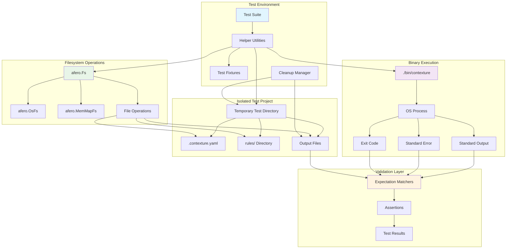
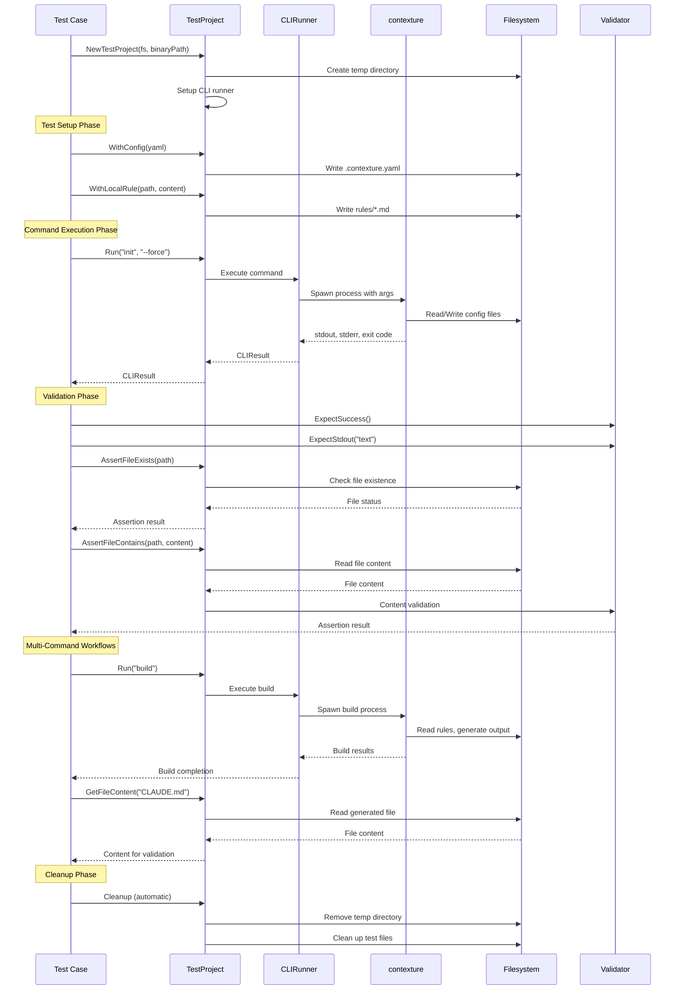
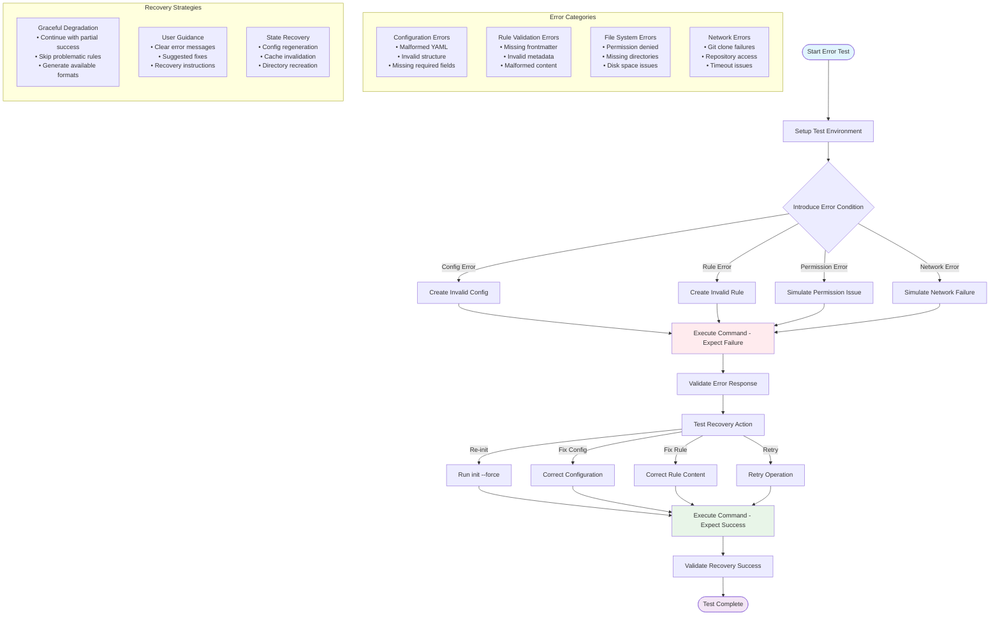
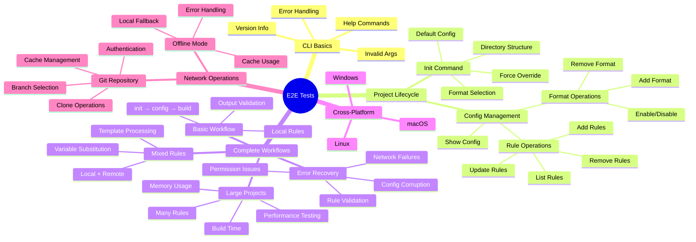

# End-to-End Test Suite

This package provides end-to-end (E2E) tests for the CLI application. It tests the complete user experience by running the compiled binary and validating its output.

## Purpose

The E2E tests validate the entire application stack by:
- Testing the actual compiled binary in realistic scenarios.
- Verifying complete user workflows from start to finish.
- Ensuring all components work together correctly in a real environment.
- Catching integration issues that unit or integration tests might miss.

## Test Coverage

- **Core CLI Functionality**: `help`, `version`, project lifecycle, rule management, and the build process.
- **Network and External Dependencies**: Git repository access and caching.
- **User Experience**: Argument parsing, flag handling, error messages, and TUI components.

## Test Execution

- **Prerequisites**: A compiled binary must be available at `./bin/contexture`.
- **Environment**: Tests run in isolated temporary directories.
- **Helpers**: A `CLIRunner` utility is used to execute commands and validate their output.

### E2E Test Architecture

### Complete Workflow Test Flow

### Error Handling and Recovery Testing

### Test Organization and Coverage

## Relationship to Other Tests

E2E tests are the final layer of testing. They have a broader scope than unit and integration tests, and they are the only tests that execute the compiled binary.