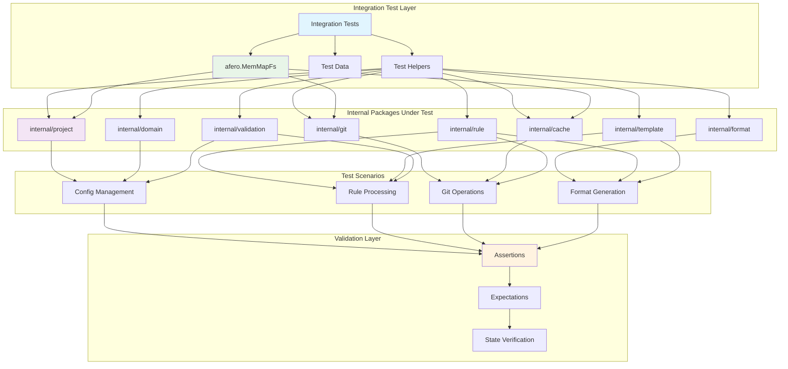
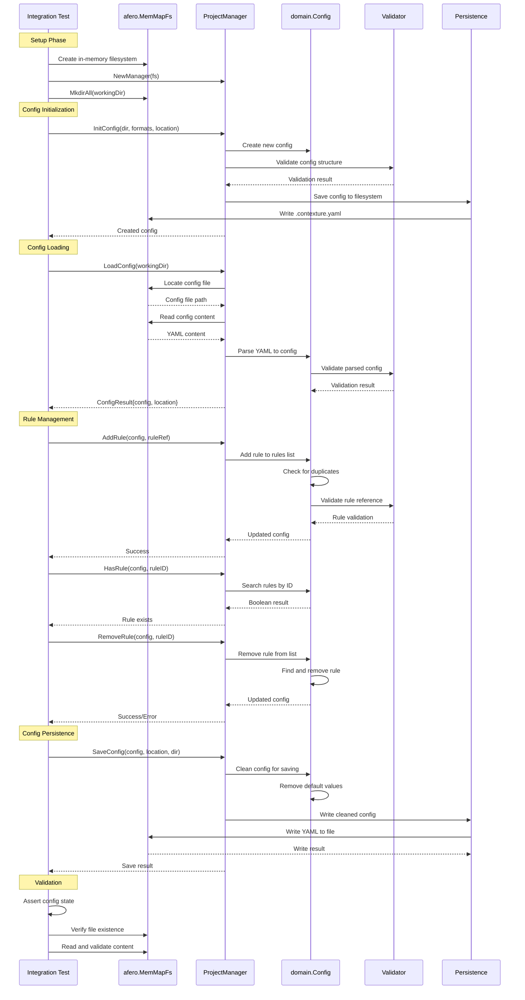
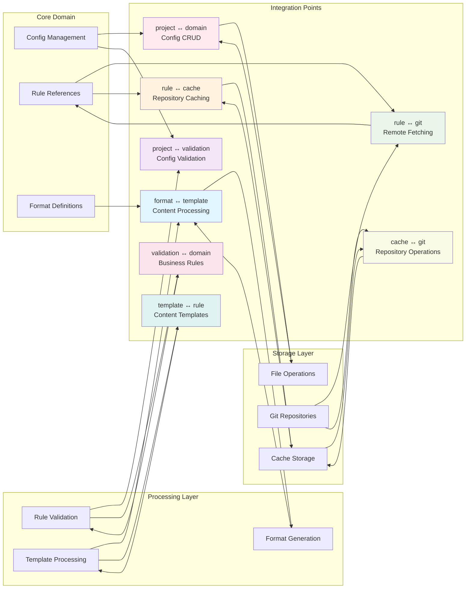
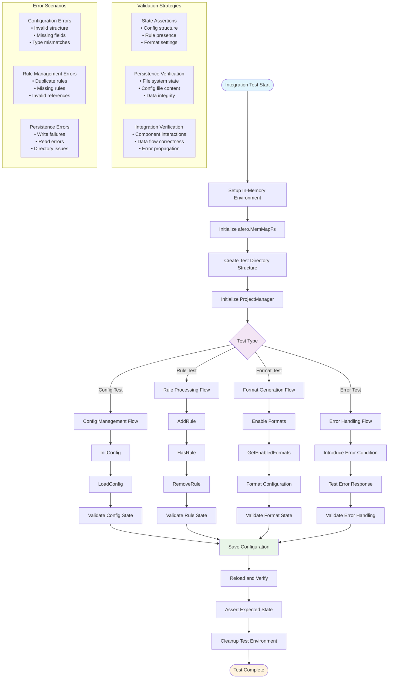

# Integration Test Suite

This package provides integration tests for the application, focusing on the interactions between internal packages and core functionality, without the overhead of full end-to-end binary execution.

## Purpose

These tests serve as a middle layer between unit and end-to-end tests by:
- Testing the interactions between multiple internal packages.
- Validating core business logic workflows without the CLI overhead.
- Providing faster feedback than full e2e tests while offering broader coverage than unit tests.

## Test Focus Areas

- **Project Management**: Configuration loading, validation, and persistence.
- **Rule Processing**: Integration between fetchers, parsers, processors, and validators.
- **Git Operations**: Repository access, caching, and rule fetching.
- **Format Generation**: End-to-end format processing.

## Testing Approach

- **In-Memory Filesystem**: Uses `afero.MemMapFs` for filesystem operations to avoid side effects and ensure fast, repeatable tests.
- **Real Components**: Tests the actual component implementations rather than mocks to validate real integration points.
- **Realistic Scenarios**: Tests common user workflows and edge cases at the component level.

### Integration Test Architecture

### Project Management Integration Flow

### Component Interaction Matrix

### Test Execution and Validation Flow

## Relationship to Other Tests

- **Compared to Unit Tests**: These tests have a broader scope, focusing on the interactions between components rather than isolated behavior.
- **Compared to E2E Tests**: These tests are faster as they don't involve CLI overhead. They focus on business logic rather than the user interface.