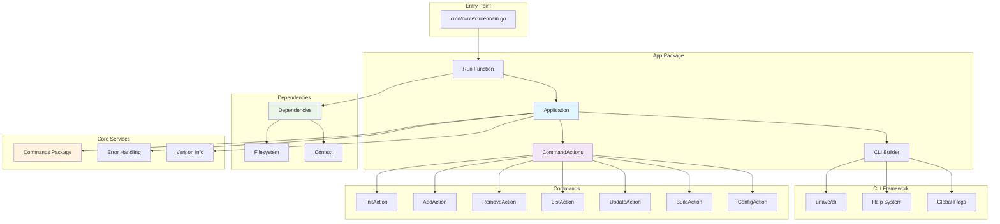
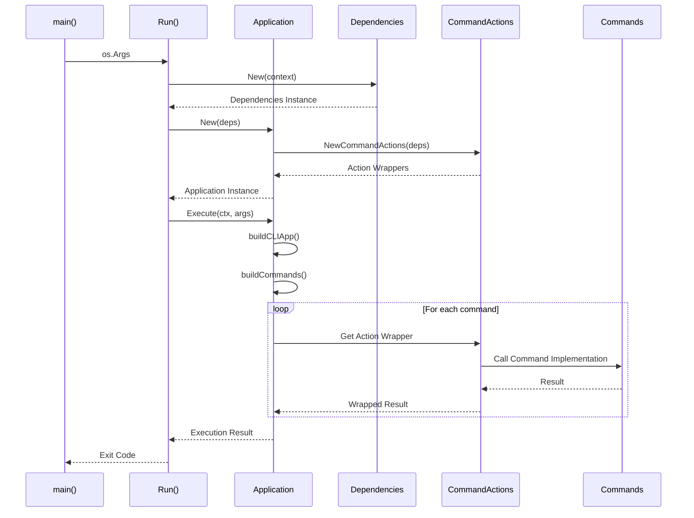
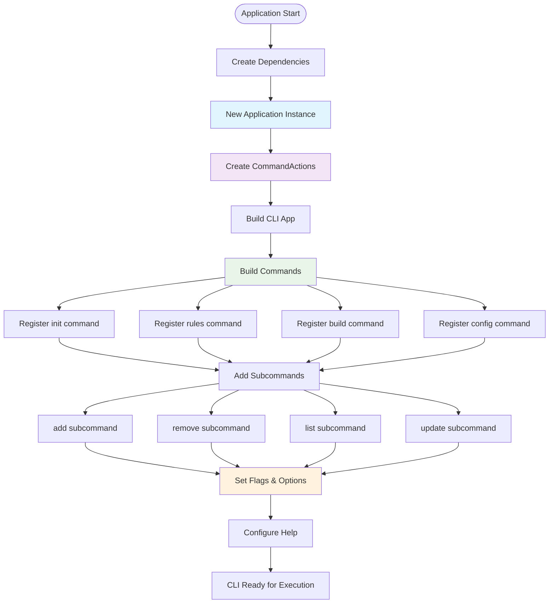

# App Package

This package provides the main application structure for the CLI. It serves as the composition root, initializing dependencies, configuring the CLI framework, and managing the application lifecycle.

## Features

- **Application Lifecycle Management**: Handles the setup and teardown of application resources.
- **Dependency Injection**: Provides a central point for creating dependencies and distributing them to commands.
- **CLI Framework Integration**: Configures and sets up the `urfave/cli` framework.
- **Command Orchestration**: Registers and organizes all CLI commands and subcommands.
- **Error Handling**: Implements unified error display and exit code management.
- **Testable Actions**: Wraps command actions to enable comprehensive testing.

### Application Architecture

### Dependency Injection Flow

### Command Registration Process

## Usage

This package is used by the main entry point (`cmd/contexture/main.go`) to run the application. It is also used in integration tests.

## API

- `New(deps) -> Application`: Creates a new application instance with the provided dependencies.
- `Run(args) -> int`: The main entry point for the application. It returns an exit code.
- `Execute(ctx, args) -> error`: Executes the CLI application with a given context and arguments.