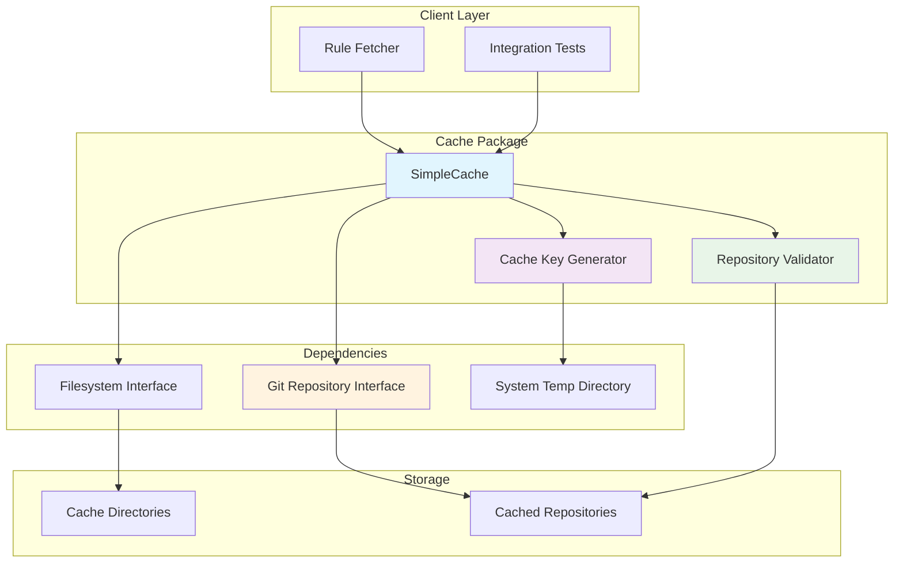
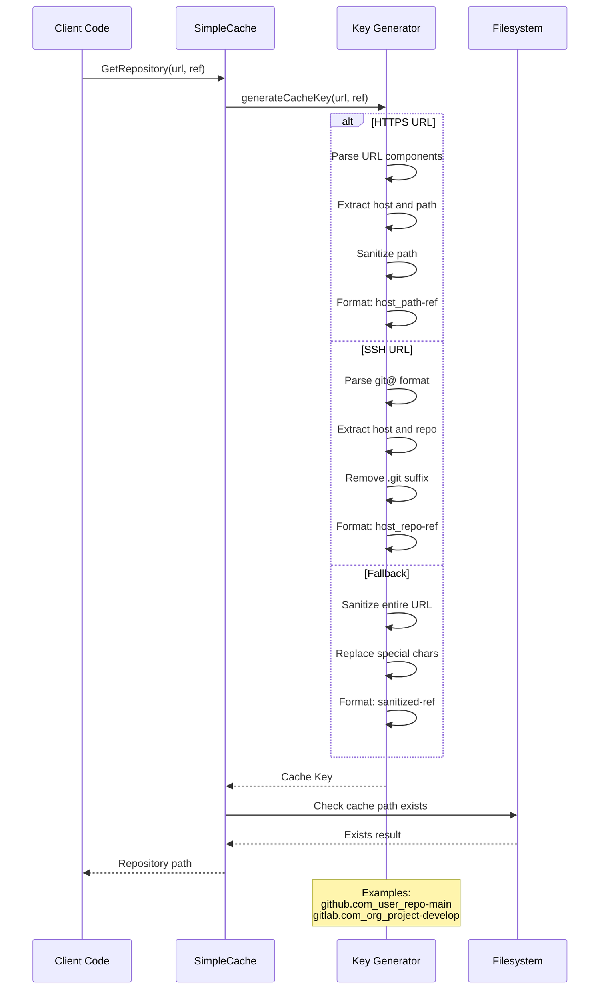

# Cache Package

This package provides a simple, cross-session caching mechanism for Git repositories. It uses human-readable directory names and stores repositories in the system's temporary directory.

## Features

- **Cross-Session Persistence**: Repositories are cached between CLI invocations, improving performance by avoiding redundant clones.
- **Human-Readable Cache Keys**: Cache directories are named based on the repository URL and Git reference (e.g., `github.com_user_repo-main`).
- **Smart Updates**: Supports both retrieving from the cache and forcing an update via `git pull`.
- **URL Support**: Handles both HTTPS and SSH Git URLs.
- **Automatic Cleanup**: Automatically removes failed clone directories.

### Cache Operations Flow

### Cache Integration Architecture

### Cache Key Generation Process

## Usage

This package is used by:
- The `rule` package for caching repositories when fetching rules.
- Integration tests to improve performance.

## API

- `NewSimpleCache(fs, repository) -> SimpleCache`: Creates a new cache instance.
- `GetRepository(ctx, repoURL, gitRef) -> string`: Returns the path to a cached repository, cloning it if it's not already cached.
- `GetRepositoryWithUpdate(ctx, repoURL, gitRef) -> string`: Forces an update of a cached repository by pulling the latest changes.