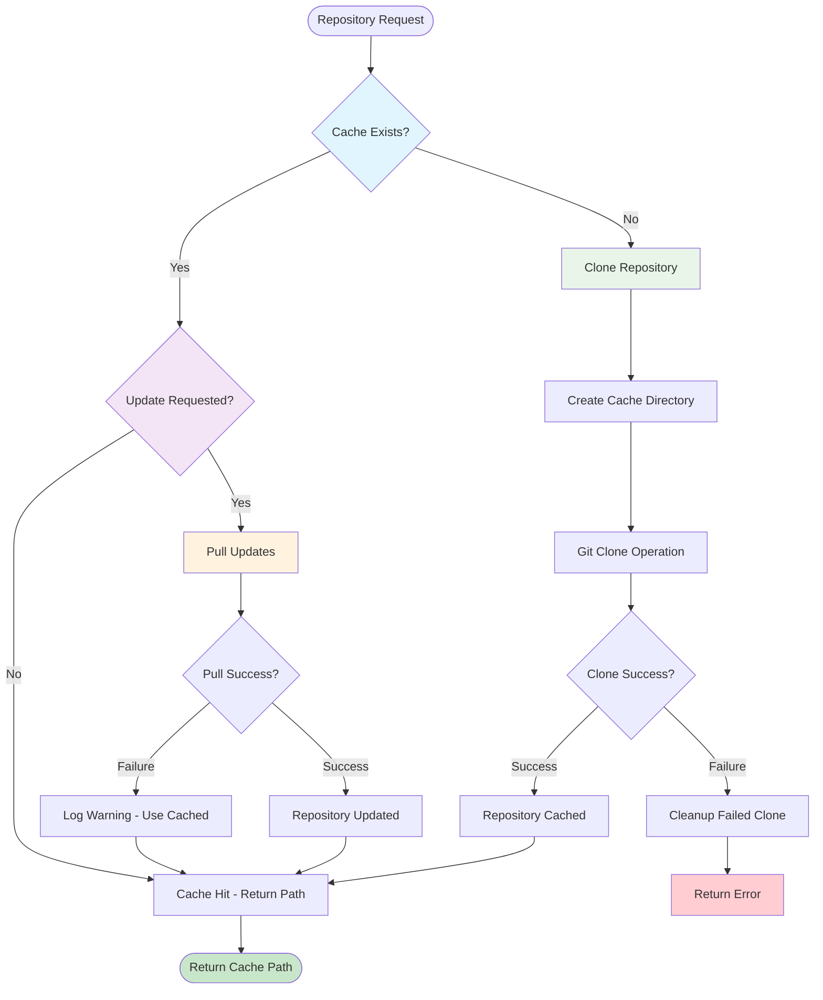
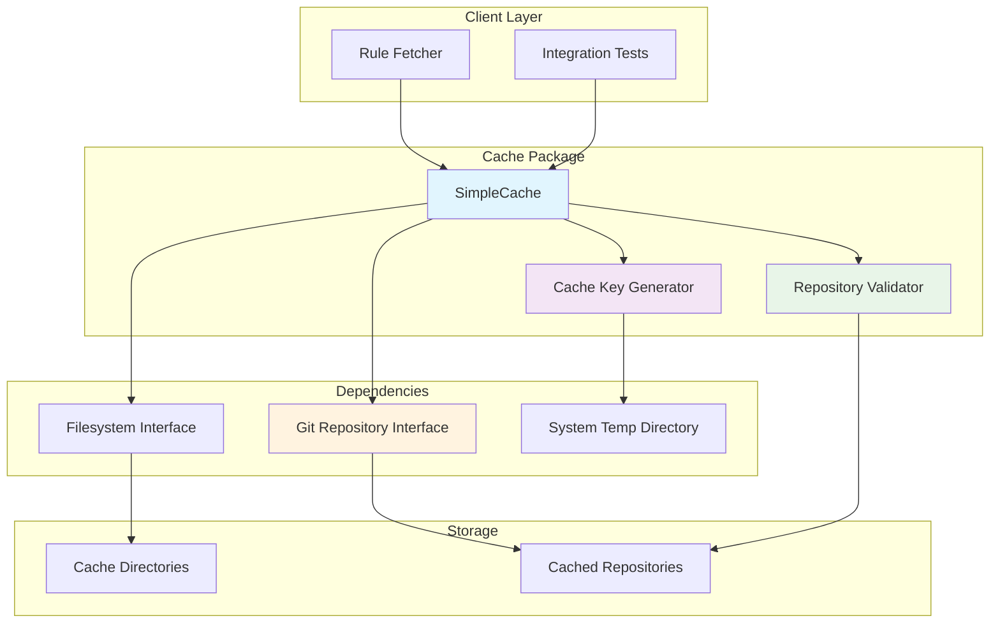
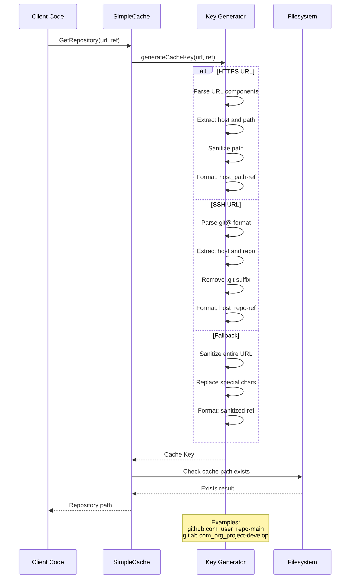

# Cache Package

This package provides a simple repository caching mechanism for Contexture, enabling cross-session persistence of Git repositories with human-readable cache directory names.

## Purpose

The cache package improves performance by storing cloned repositories locally, avoiding redundant clone operations across CLI sessions. It manages repository updates intelligently and provides clean, predictable cache keys for easy maintenance.

## Key Features

- **Cross-Session Persistence**: Repositories remain cached between CLI invocations
- **Human-Readable Cache Keys**: Generated from repository URLs and Git references (e.g., `github.com_user_repo-main`)
- **Smart Updates**: Supports both cached retrieval and forced updates with git pull
- **URL Format Support**: Handles both HTTPS and SSH Git URLs with proper parsing
- **Automatic Cleanup**: Failed clones are cleaned up automatically
- **Temp Directory Storage**: Uses system temp directory for cache storage

## Cache Key Generation

The package creates predictable cache directory names by:
- Parsing repository URLs (both `https://` and `git@` formats)
- Extracting hostname and path components
- Sanitizing special characters to filesystem-safe names
- Appending the Git reference (branch/tag/commit)

### Cache Operations Flow

### Cache Integration Architecture

### Cache Key Generation Process

## Usage Within Project

This package is used by:
- **Rule Package**: Git fetcher uses caching for repository-based rule retrieval
- **Integration Tests**: Repository operations leverage caching for test performance

## API

- `NewSimpleCache(fs, repository)`: Creates a cache instance with filesystem and git repository dependencies
- `GetRepository(ctx, repoURL, gitRef)`: Returns cached repository path or clones if not cached
- `GetRepositoryWithUpdate(ctx, repoURL, gitRef)`: Forces updates to cached repositories with latest changes