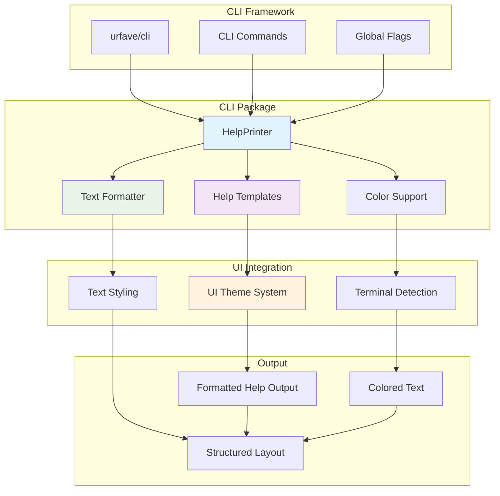
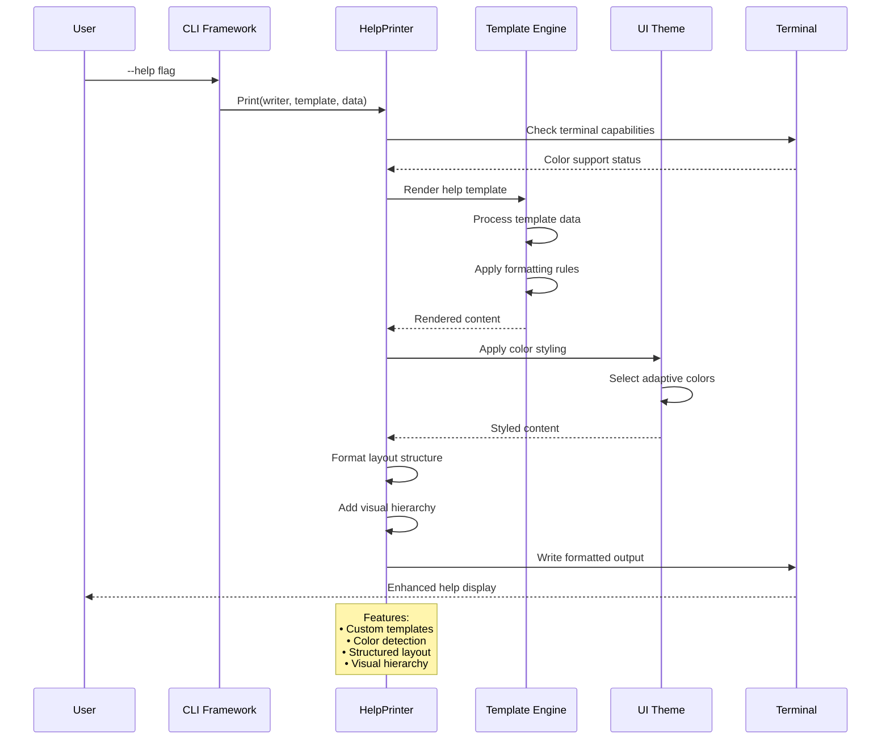
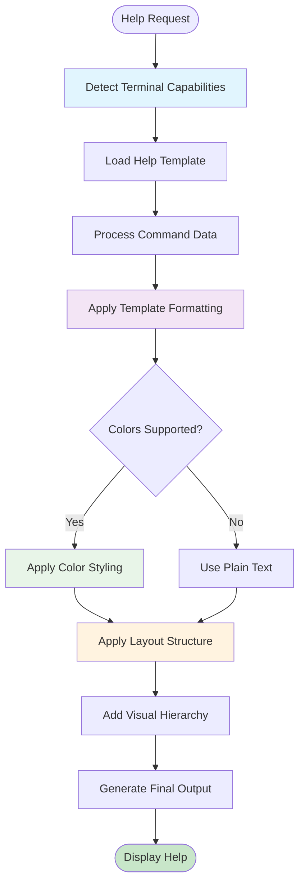

# CLI Package

This package provides utilities for the command-line interface, including custom help formatting, command rendering, and colored output. It enhances the `urfave/cli` library to improve the user experience.

## Features

- **Custom Help Templates**: Provides enhanced help formatting with better organization and readability.
- **Color Support**: Uses terminal-aware colored output to improve visual hierarchy.
- **Consistent Theming**: Integrates with the internal `ui` package for consistent styling.
- **Enhanced Formatting**: Improves the presentation of commands and options.

### Help System Architecture

### Help Rendering Pipeline

### Template System Integration

## Usage

This package is used by the `app` package to configure the CLI application's help rendering and user interaction elements.

## API

- `NewHelpPrinter() -> HelpPrinter`: Creates a new help printer with enhanced formatting.
- `Print(writer, template, data)`: Renders help content using a custom template and formatting.
- `AppHelpTemplate`: A custom template for the application-level help display.