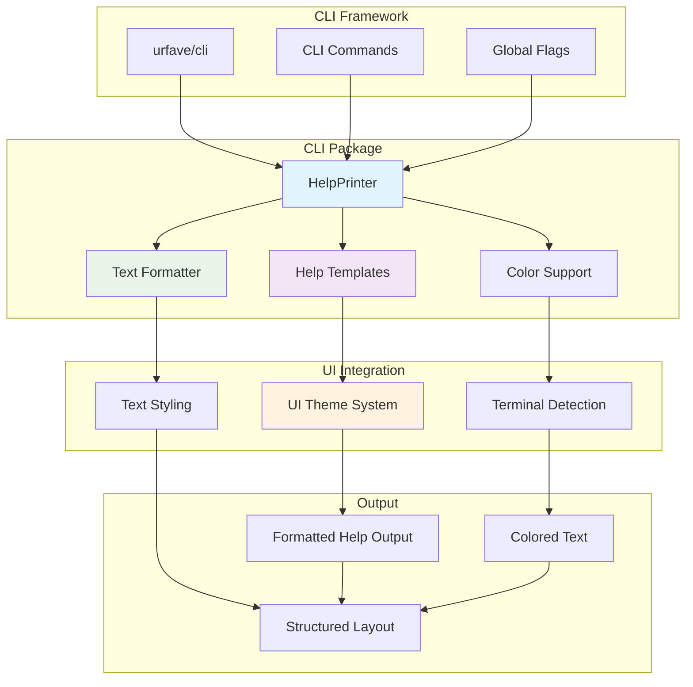
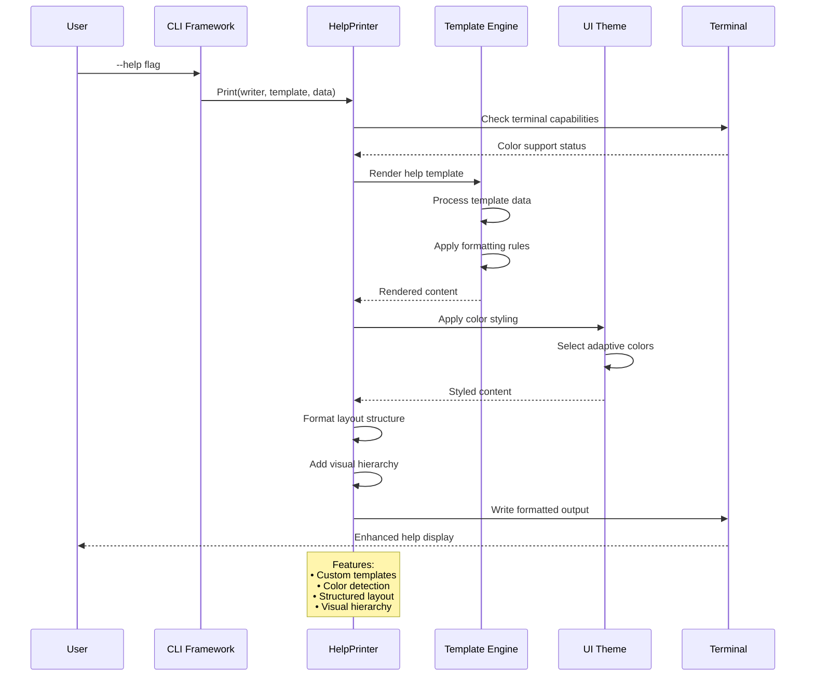

# CLI Package

This package provides command-line interface utilities for the Contexture application, including enhanced help formatting, command rendering, and user interaction components with color support and improved usability.

## Purpose

The cli package enhances the standard urfave/cli experience by providing customized help templates, colored output, and improved formatting for better user experience. It bridges the gap between the CLI framework and user-facing presentation.

## Key Features

- **Custom Help Templates**: Enhanced help formatting with better organization and readability
- **Color Support**: Terminal-aware colored output for improved visual hierarchy
- **Consistent Theming**: Integration with internal UI components for unified styling
- **Enhanced Formatting**: Improved command and option presentation
- **User Experience**: Focus on clarity and ease of use for CLI interactions

## Help System Enhancement

- **Template Customization**: Custom help templates that improve upon urfave/cli defaults
- **Structured Layout**: Better organization of commands, flags, and descriptions
- **Visual Hierarchy**: Use of colors and formatting to guide user attention
- **Contextual Help**: Relevant help information displayed at the right time

## Integration Points

- **urfave/cli Framework**: Seamless integration with the CLI framework
- **Terminal Detection**: Automatic color support detection based on terminal capabilities
- **Theme Consistency**: Coordinated styling across all user-facing components

### Help System Architecture

### Help Rendering Pipeline

### Template System Integration

## Usage Within Project

This package is used by:
- **App Package**: Main application uses CLI utilities for help rendering and user interaction
- **Command Framework**: All commands benefit from enhanced help and formatting capabilities

## API

- `NewHelpPrinter()`: Creates a new help printer with enhanced formatting
- `Print(writer, template, data)`: Renders help content with custom formatting
- `AppHelpTemplate`: Custom template for application-level help display
- Color and formatting utilities for consistent CLI presentation