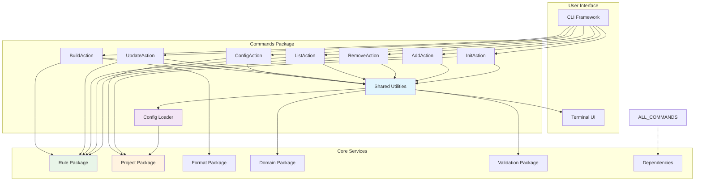
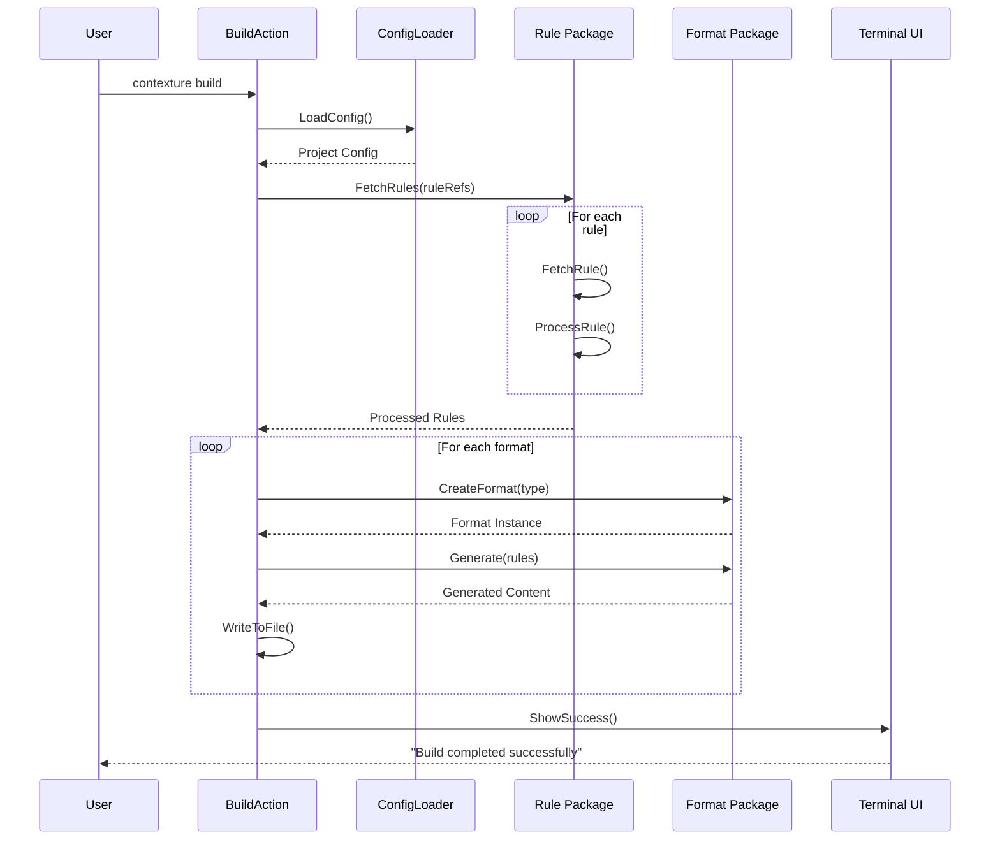
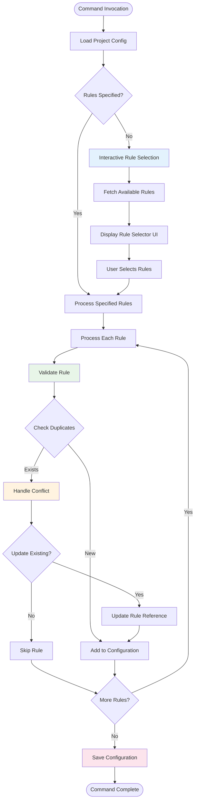

# Commands Package

This package implements the actions for all CLI commands. It serves as the business logic layer that connects the CLI framework to the underlying domain operations.

## Commands

### Project Management
- `init`: Initializes a new project with a default configuration.
- `config`: Manages project configuration.

### Rule Operations
- `add`: Adds new rules to the project from local files or Git repositories.
- `remove`: Removes rules from the project configuration.
- `list`: Lists the rules in the project.
- `update`: Updates existing rules from their sources.

### Build System
- `build`: Generates output files in the configured formats.

### Command Flow Architecture

### Build Command Flow

### Add/Update Command Flow

## Architecture

- **Command Actions**: Each command is implemented as a separate action with a clear separation of concerns.
- **Shared Utilities**: Common functionality, such as configuration loading and validation, is shared across commands.
- **Error Handling**: All commands use the centralized error handling package to provide consistent, user-friendly error messages and appropriate exit codes.

## Usage

This package is used by the `app` package, which delegates all command execution to the actions in this package.