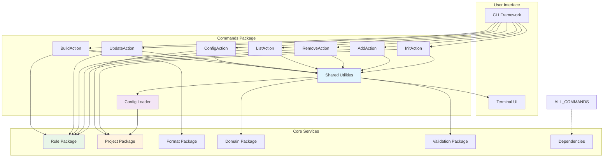
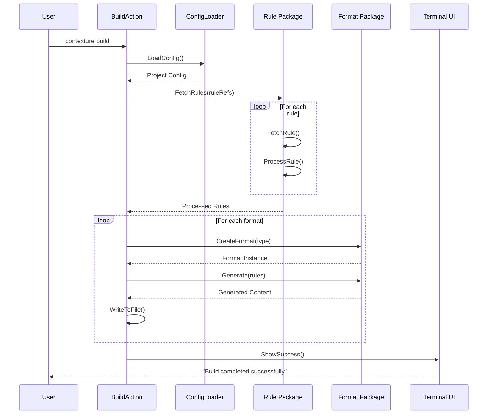

# Commands Package

This package implements all CLI command actions for the Contexture application, providing the core functionality that users interact with through the command-line interface. It serves as the business logic layer between the CLI framework and the underlying domain operations.

## Purpose

The commands package translates user intentions expressed through CLI arguments and flags into concrete operations on projects, rules, and configurations. It orchestrates domain services while providing user feedback and error handling.

## Available Commands

### Project Management
- **init**: Initialize new Contexture projects with default configurations
- **config**: Manage project configuration with subcommands for formats and settings

### Rule Operations
- **add**: Add new rules to projects from various sources (local files, repositories)
- **remove**: Remove existing rules from project configurations
- **list**: Display project rules with filtering and formatting options
- **update**: Update existing rules from their original sources

### Build System
- **build**: Generate output files in configured formats (Claude, Cursor, Windsurf)

## Key Features

- **Unified Error Handling**: Consistent error reporting across all commands
- **Configuration Management**: Loading and validation of project configurations
- **Rule Processing**: Integration with rule fetchers, validators, and processors
- **Format Integration**: Coordination with format implementations for output generation
- **User Interaction**: Terminal UI components for user prompts and selections
- **Shared Utilities**: Common functionality reused across command implementations

## Architecture

- **Command Actions**: Individual command implementations with clear separation of concerns
- **Shared Utilities**: Common functionality for configuration loading, validation, and user interaction
- **Config Loaders**: Specialized utilities for loading and managing project configurations
- **Test Helpers**: Support utilities for comprehensive command testing

### Command Flow Architecture

### Build Command Flow

### Add/Update Command Flow

## Integration Points

Commands integrate with various internal packages:
- **Domain Package**: Operations on rules and project entities
- **Project Package**: Configuration persistence and management
- **Format Package**: Output generation in multiple formats
- **Validation Package**: Data validation and constraint checking
- **Rule Package**: Rule processing and template rendering

## Usage Within Project

This package is used by:
- **App Package**: Application structure delegates all command execution to this package
- **Integration Tests**: End-to-end testing exercises command functionality

## Error Handling

All commands provide consistent error handling with:
- Structured error types with appropriate exit codes
- User-friendly error messages with actionable suggestions
- Validation feedback with field-specific context
- Recovery guidance for common error scenarios