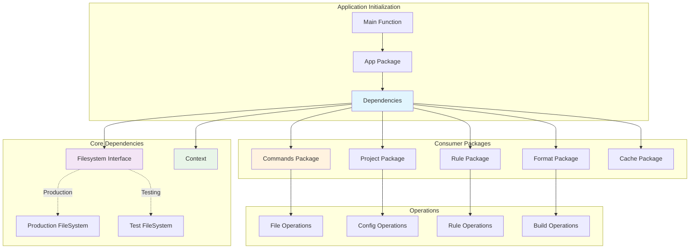
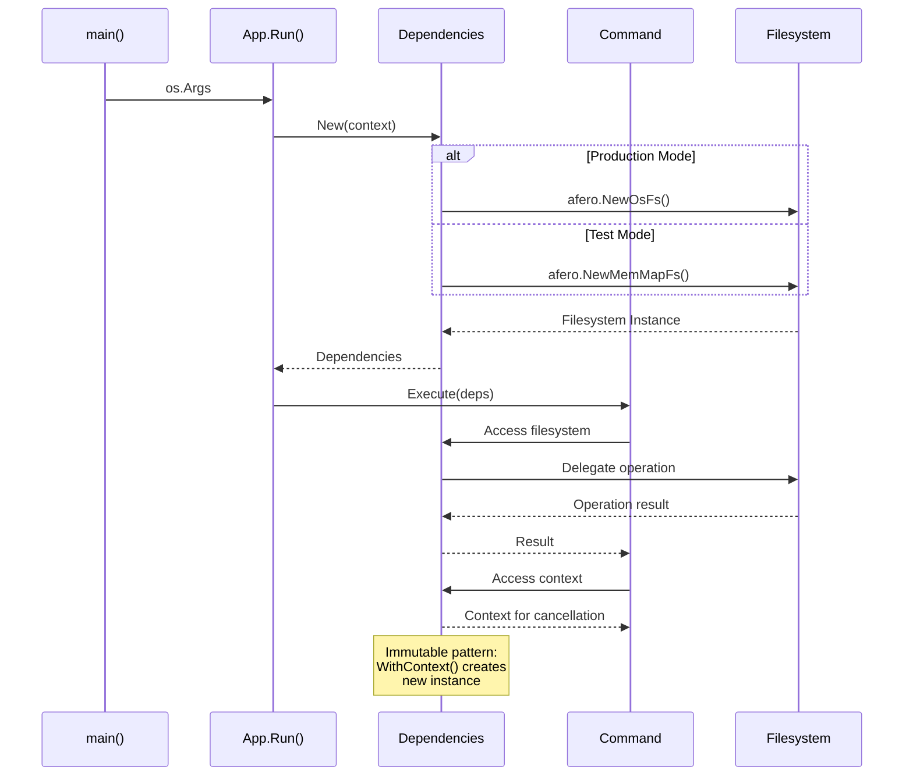
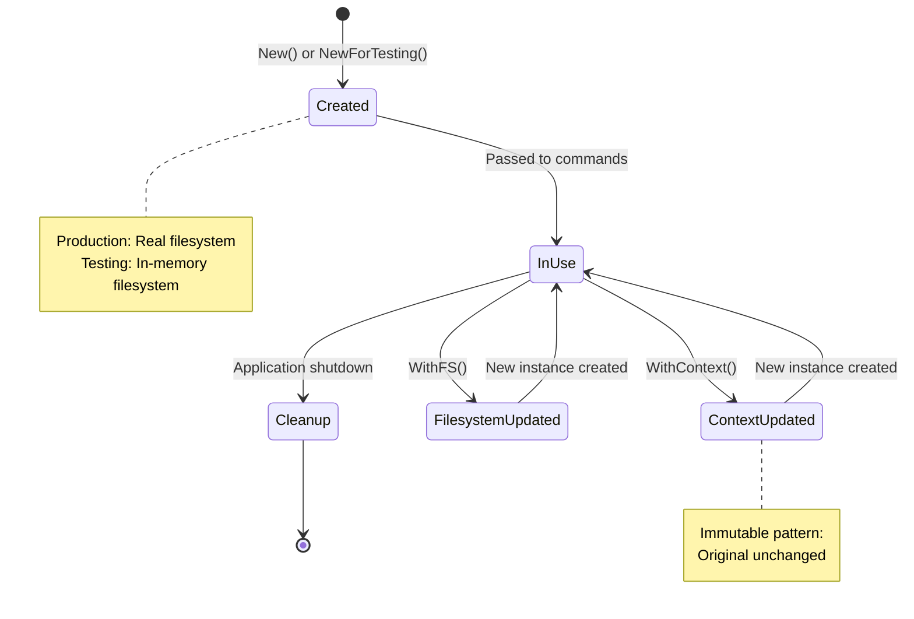

# Dependencies Package

This package provides a minimal dependency injection container for the application. It manages core dependencies like the filesystem and application context, promoting testability and separation of concerns.

## Features

- **Minimal Design**: Manages only essential dependencies: the filesystem and the application `context`.
- **Testability**: Provides a testing constructor that uses an in-memory filesystem to avoid side effects in tests.
- **Immutability**: Methods that update dependencies, like `WithContext`, return a new instance rather than modifying the existing one.
- **Context Propagation**: Facilitates proper `context` handling for cancellation and request scoping.

## Managed Dependencies

- **Filesystem**: Uses the `afero.Fs` interface to abstract filesystem operations.
- **Application Context**: Manages the `context.Context` for application lifecycle and cancellation.

### Dependency Flow Architecture

### Dependency Injection Pattern

### Dependencies Lifecycle

## API

- `New(ctx) -> Dependencies`: Creates a new dependencies container for production use with a real filesystem.
- `NewForTesting(ctx) -> Dependencies`: Creates a new dependencies container for testing with an in-memory filesystem.
- `WithContext(ctx) -> Dependencies`: Returns a new `Dependencies` instance with an updated `context`.
- `WithFS(fs) -> Dependencies`: Returns a new `Dependencies` instance with a different filesystem implementation.