# Dependencies Package

This package provides minimal dependency injection for the Contexture CLI application. It manages core dependencies like filesystem operations and context propagation in a clean, testable way without heavy dependency injection frameworks.

## Purpose

The dependencies package serves as a lightweight container for essential application dependencies, enabling clean separation of concerns and facilitating testing through dependency substitution. It provides a simple alternative to complex DI frameworks while maintaining testability and flexibility.

## Key Features

- **Minimal Design**: Contains only essential dependencies (filesystem and context)
- **Production Defaults**: Real filesystem operations for normal application usage
- **Testing Support**: In-memory filesystem variant to avoid side effects during tests
- **Immutable Updates**: Methods return new instances rather than modifying existing ones
- **Context Propagation**: Proper context handling for cancellation and request scoping

## Dependencies Managed

- **Filesystem Operations**: Uses `afero.Fs` interface for file system abstraction
- **Application Context**: Manages `context.Context` for lifecycle and cancellation

## Usage Within Project

This package is used extensively throughout the application:
- **Commands Package**: All CLI commands receive dependencies for file operations
- **App Package**: Main application initialization and dependency setup
- **Actions**: Application actions use dependencies for their operations

### Dependency Flow Architecture

### Dependency Injection Pattern

```mermaid
sequenceDiagram
    participant Main as main()
    participant App as App.Run()
    participant Deps as Dependencies
    participant Cmd as Command
    participant FS as Filesystem
    
    Main->>App: os.Args
    App->>Deps: New(context)
    
    alt Production Mode
        Deps->>FS: afero.NewOsFs()
    else Test Mode
        Deps->>FS: afero.NewMemMapFs()
    end
    
    FS-->>Deps: Filesystem Instance
    Deps-->>App: Dependencies
    
    App->>Cmd: Execute(deps)
    
    Cmd->>Deps: Access filesystem
    Deps->>FS: Delegate operation
    FS-->>Deps: Operation result
    Deps-->>Cmd: Result
    
    Cmd->>Deps: Access context
    Deps-->>Cmd: Context for cancellation
    
    note over Deps: Immutable pattern:<br/>WithContext() creates<br/>new instance
```

### Dependencies Lifecycle

## API

- `New(ctx)`: Creates production dependencies with real filesystem
- `NewForTesting(ctx)`: Creates test dependencies with in-memory filesystem  
- `WithContext(ctx)`: Returns new instance with different context
- `WithFS(fs)`: Returns new instance with different filesystem implementation

## Testing Benefits

The testing variant uses an in-memory filesystem (`afero.NewMemMapFs()`) which provides:
- No file system side effects during tests
- Faster test execution
- Isolated test environments
- Deterministic test behavior