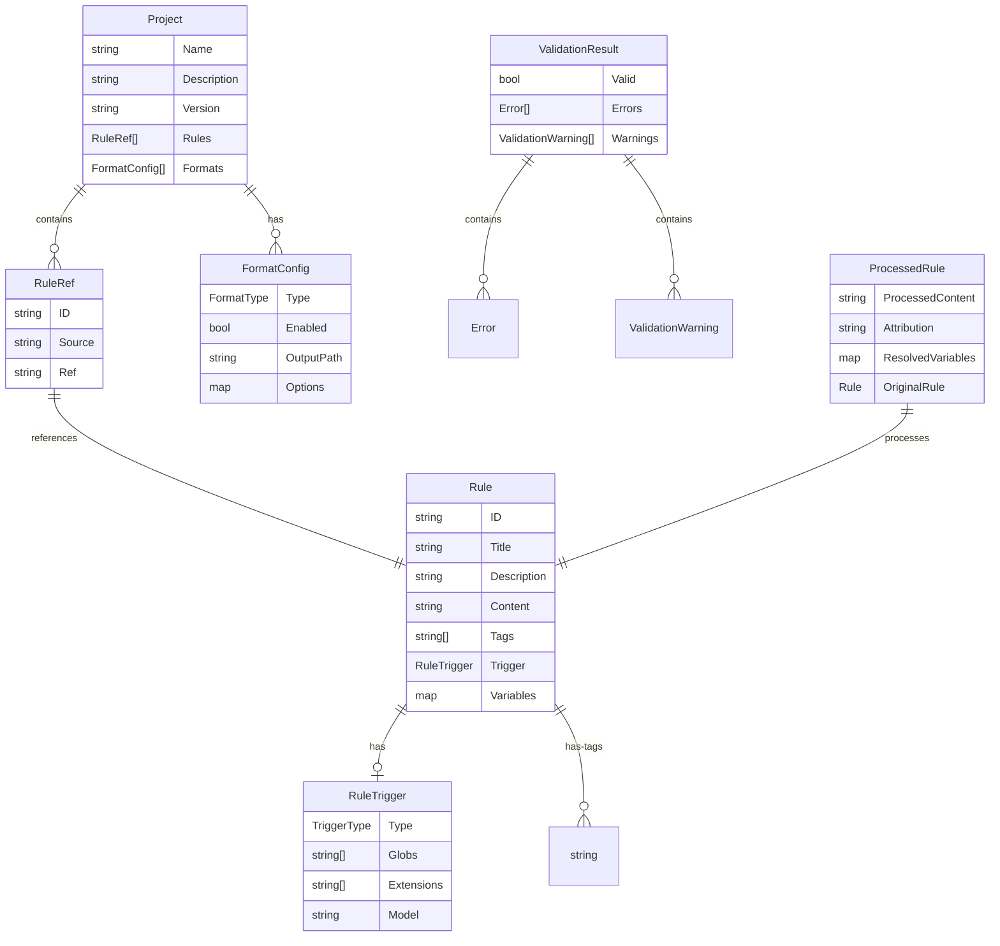
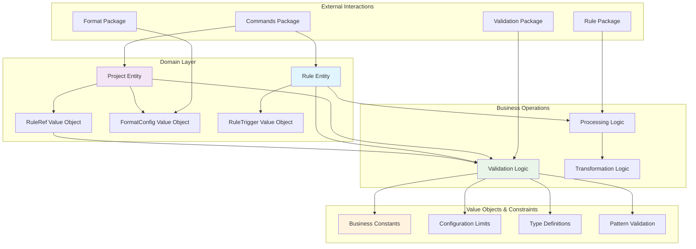
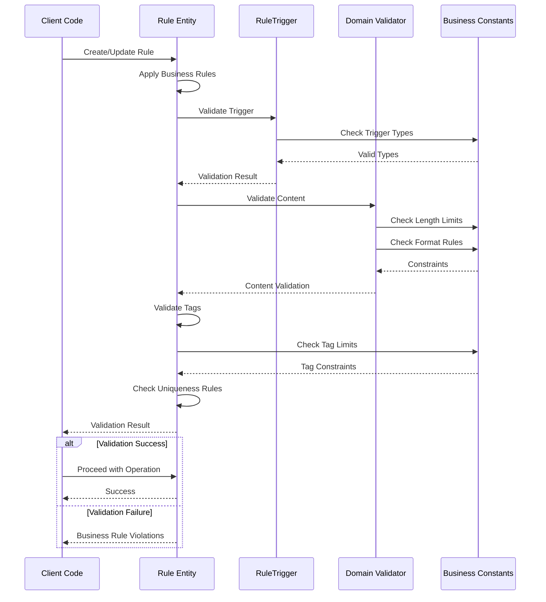

# Domain Package

This package contains the core business logic and domain models for Contexture, implementing Domain-Driven Design principles. It defines the essential entities, value objects, and interfaces that form the heart of the application's business rules.

## Purpose

The domain package serves as the central repository for all business logic, maintaining independence from infrastructure concerns. It establishes the fundamental concepts, constraints, and behaviors that define what Contexture does and how it operates.

## Key Components

- **Core Entities**: `Rule` and `Project` representing the primary business objects
- **Value Objects**: Type-safe structures like `RuleRef`, `FormatConfig`, and trigger types
- **Domain Interfaces**: Format operations and validation contracts
- **Business Constants**: Configuration limits, format types, and trigger definitions
- **Domain Services**: Configuration management and rule tree operations

## Domain-Driven Design Principles

- **Ubiquitous Language**: Consistent terminology used throughout the codebase
- **Rich Domain Models**: Entities contain behavior, not just data
- **Infrastructure Independence**: No dependencies on databases, frameworks, or external services
- **Business Rule Centralization**: All business logic resides within domain boundaries

## Core Entities

- **Rule**: Represents a contexture rule with content, metadata, triggers, and validation logic
- **Project**: Manages project configuration including rules, formats, and validation constraints
- **Rule Tree**: Hierarchical organization of rules for efficient processing

### Domain Model Relationships

### Business Logic Flow

### Validation and Business Rules

## Usage Within Project

This package is used extensively throughout the application:
- **Validation Package**: Validates domain entities and enforces business rules
- **Commands Package**: All CLI operations work with domain entities  
- **Format Package**: Format implementations use domain interfaces and entities
- **Rule Package**: Rule processing operations center around domain models
- **Project Package**: Configuration management operates on domain entities

## Design Benefits

- **Testability**: Pure domain logic enables comprehensive unit testing
- **Maintainability**: Business rules are centralized and clearly defined
- **Flexibility**: Infrastructure can change without affecting business logic
- **Clarity**: Domain concepts are explicitly modeled and named