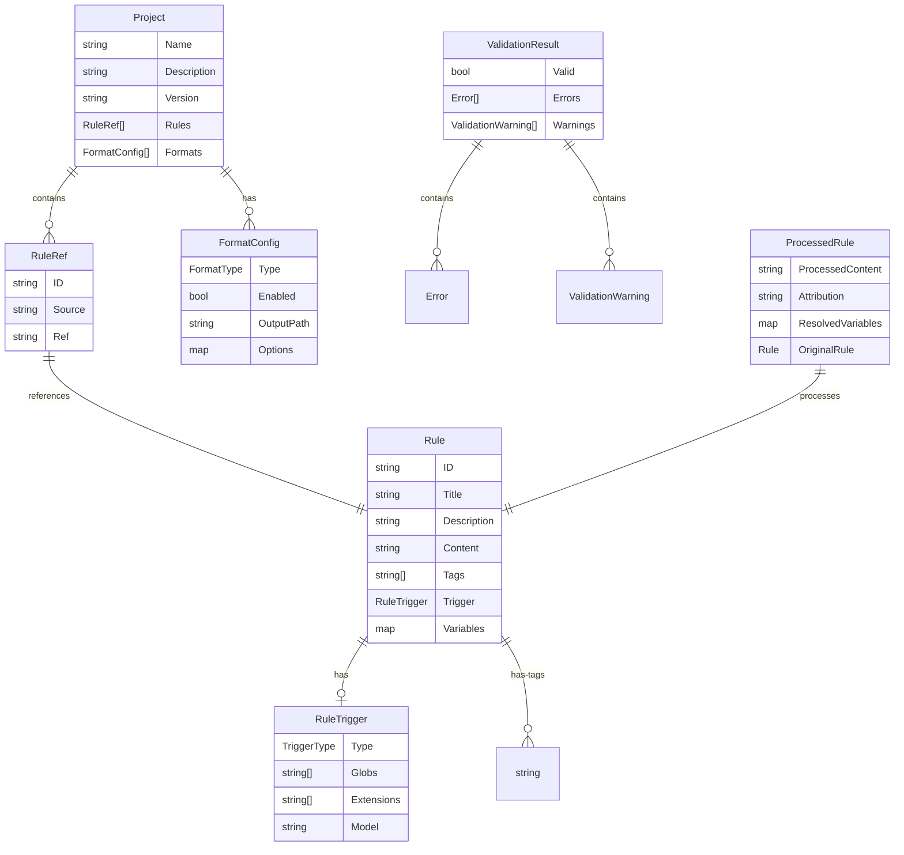
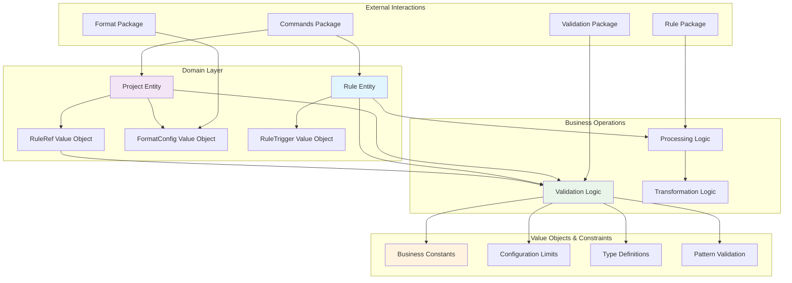
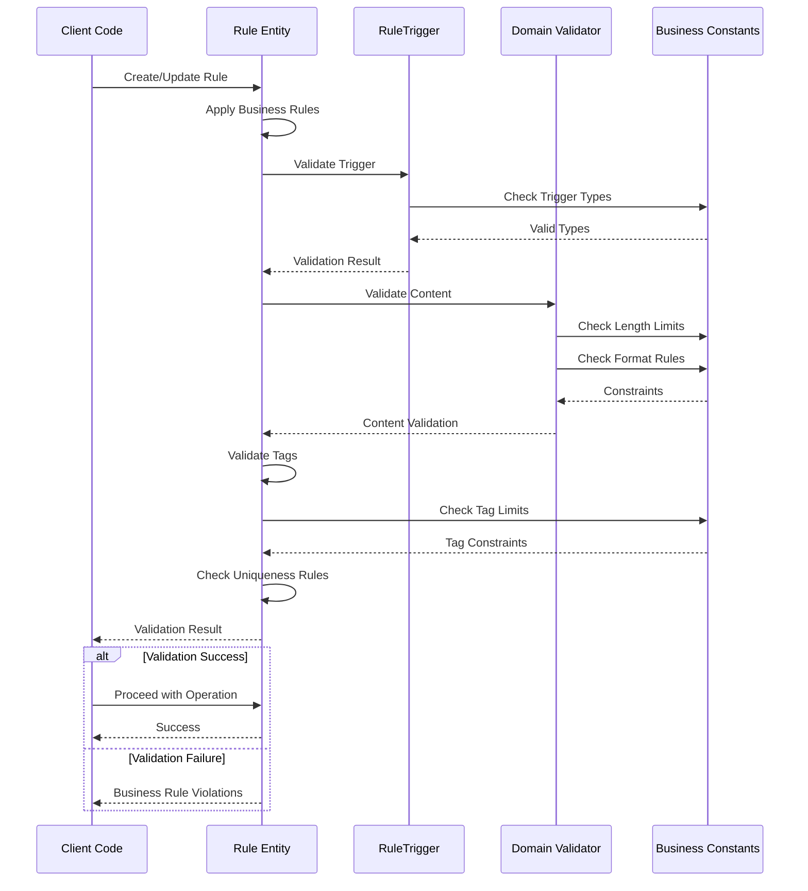

# Domain Package

This package contains the core business logic and domain models for the application, following Domain-Driven Design (DDD) principles. It defines the central entities, value objects, and business rules.

## Core Components

- **Entities**: The primary business objects, `Rule` and `Project`.
- **Value Objects**: Type-safe structures for concepts like `RuleRef`, `FormatConfig`, and `RuleTrigger`.
- **Business Constants**: Defines configuration limits, format types, and trigger types.

## Domain-Driven Design Principles

- **Infrastructure Independence**: The domain package has no dependencies on infrastructure concerns like databases or frameworks.
- **Centralized Business Rules**: All business logic is located within this package.

### Domain Model Relationships

### Business Logic Flow

### Validation and Business Rules

## Usage

This package is used by most other packages in the application, including:
- `validation`: For validating domain entities.
- `commands`: For working with domain entities in CLI operations.
- `format`: For using domain interfaces and entities in format implementations.
- `rule`: For processing domain models.
- `project`: For managing configurations of domain entities.