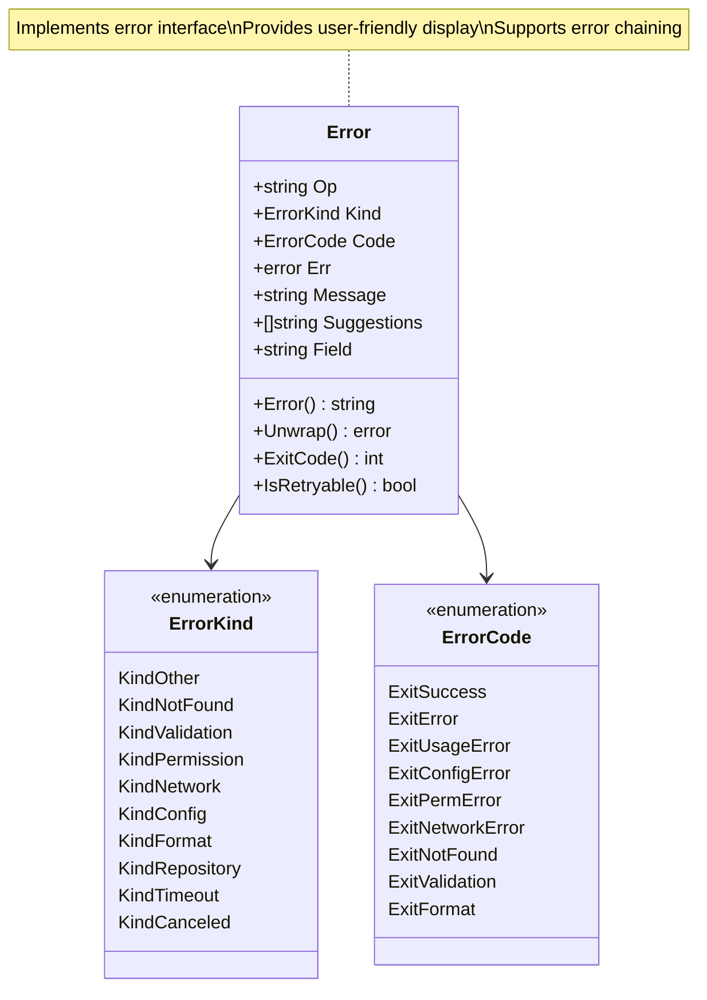
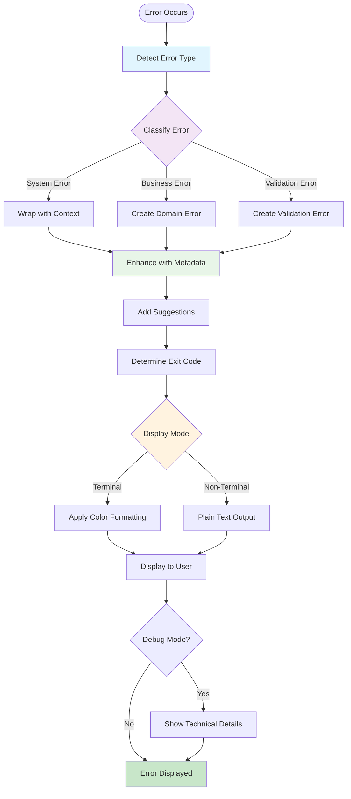
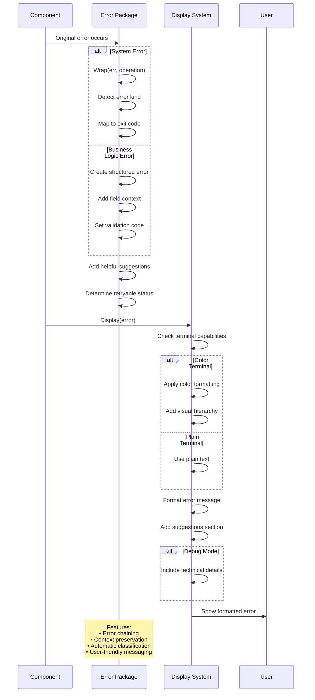

# Errors Package

This package provides a unified error handling system for the application. It defines structured error types with user-friendly messaging and consistent error categorization.

## Features

- **Structured Error Types**: Errors include operation context, error kinds, and exit codes.
- **User-Friendly Messaging**: Provides clear, actionable error messages with helpful suggestions.
- **Error Classification**: Categorizes errors into domains like `validation`, `network`, and `permission`.
- **Exit Code Management**: Defines standardized exit codes for different error types.
- **Retryable Error Detection**: Identifies transient failures that can be retried.
- **Terminal-Aware Display**: Supports color-coded error output.

## Error Categories

Errors are classified into several kinds, including:
- `Validation`: Data validation failures.
- `Network`: Connection issues and timeouts.
- `Permission`: Access denied and authorization failures.
- `Configuration`: Invalid configuration files or settings.
- `Repository`: Git repository operation failures.
- `NotFound`: Missing resources or files.

### Error Type Hierarchy

### Error Processing Pipeline

### Error Flow Through System

## Usage

This package is used throughout the application to ensure consistent error handling.

## API

- `Wrap(err, op) -> error`: Adds operational context to an existing error.
- `Validation(field, message) -> error`: Creates a field-specific validation error.
- `Display(err)`: Renders a user-friendly error message, with colors and suggestions if in a terminal.
- `IsRetryable(err) -> bool`: Checks if an error represents a transient failure.
- The `Error` type implements the standard `Error()`, `Unwrap()`, and `ExitCode()` methods.