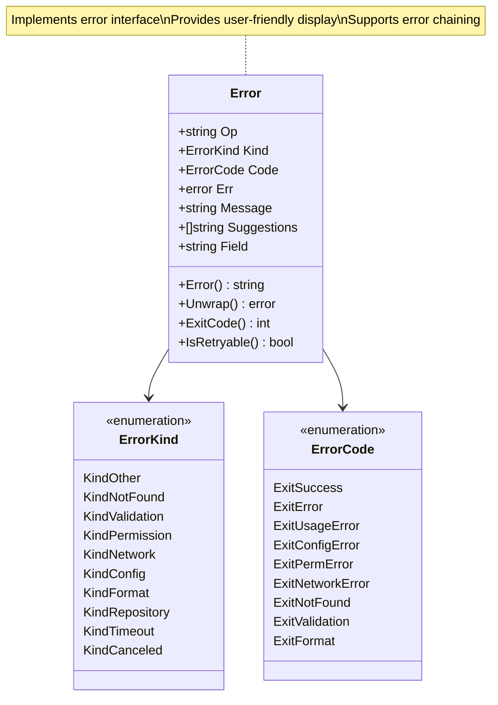
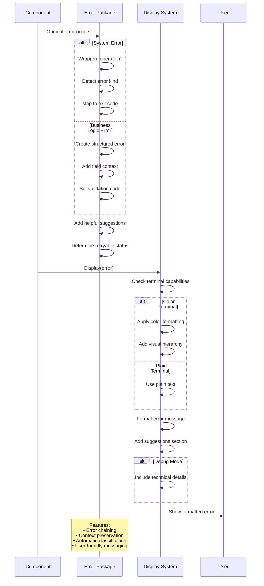

# Errors Package

This package provides unified error handling for the Contexture CLI with structured error types, user-friendly messaging, and consistent error categorization across the entire application.

## Purpose

The errors package standardizes error handling throughout Contexture, providing rich error information that helps both users and developers understand what went wrong and how to fix it. It bridges the gap between technical errors and user-friendly messaging.

## Key Features

- **Structured Error Types**: Rich error objects with operation context, error kinds, and exit codes
- **User-Friendly Messaging**: Clear, actionable error messages with helpful suggestions
- **Error Classification**: Categorizes errors into domains (validation, network, permission, etc.)
- **Exit Code Management**: Standardized exit codes for different error types
- **Retryable Error Detection**: Automatic identification of transient failures
- **Terminal-Aware Display**: Color-coded error output with proper terminal detection

## Error Categories

- **Validation**: Data validation failures with field-specific context
- **Network**: Connection issues, timeouts, and network-related failures  
- **Permission**: Access denied and authorization failures
- **Configuration**: Invalid configuration files or settings
- **Repository**: Git repository operations and access issues
- **Format**: Template parsing and rendering errors
- **Not Found**: Missing resources or files

### Error Type Hierarchy

### Error Processing Pipeline

### Error Flow Through System

## Error Enhancement

- **Context Wrapping**: Preserves error chains while adding operational context
- **Suggestions**: Automated helpful suggestions based on error type
- **Debug Information**: Technical details available in debug mode
- **Field-Level Validation**: Specific field validation with error codes

## Usage Within Project

This package is used universally throughout the application:
- **Commands Package**: All CLI operations use structured error handling
- **Domain Package**: Business rule violations generate domain-specific errors
- **Validation Package**: Field validation errors with detailed context
- **Git Package**: Repository operation failures with retry logic
- **Format Package**: Template processing errors with context

## API

- `Wrap(err, op)`: Adds operational context to existing errors
- `Validation(field, message)`: Creates field-specific validation errors
- `Display(err)`: User-friendly error display with colors and suggestions
- `IsRetryable(err)`: Detects if an error represents a transient failure
- Error types implement proper `Error()`, `Unwrap()`, and `ExitCode()` methods