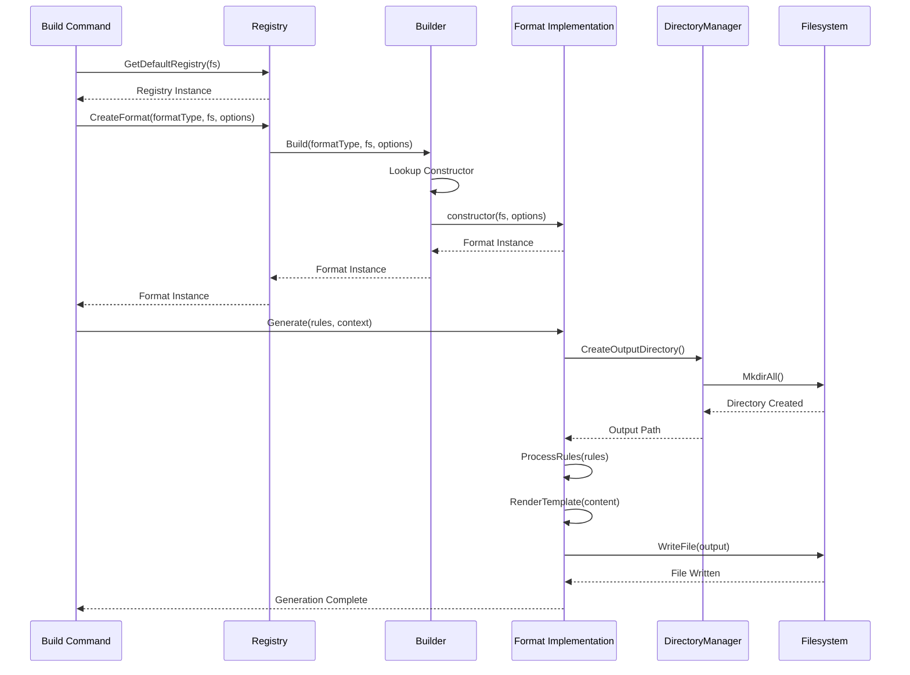

# Format Package

This package manages the output format implementations for various AI assistant platforms. It uses a registry for format discovery and a builder pattern for creating format instances.

## Architecture

- **Registry Pattern**: A central registry is used to discover and manage available formats (e.g., `claude`, `cursor`). It includes UI handlers for format selection and configuration.
- **Builder Pattern**: A factory pattern is used to create format instances with their specific configurations.
- **Base Infrastructure**: Provides common interfaces, directory management utilities, and UI integration for all formats.

### Registry and Builder Pattern

```mermaid
graph TB
    subgraph "Format Package"
        REG[Registry]
        BUILDER[Builder]
        DIRMGR[DirectoryManager]
        INTERFACES[Interfaces]
    end
    
    subgraph "Format Implementations"
        CLAUDE[Claude Format]
        CURSOR[Cursor Format]
        WINDSURF[Windsurf Format]
        CHAND[Claude Handler]
        CURHAND[Cursor Handler]
        WINHAND[Windsurf Handler]
    end
    
    subgraph "External Dependencies"
        FS[Filesystem]
        DOMAIN[Domain Package]
        UI[UI Package]
        TEMPLATE[Template Package]
    end
    
    subgraph "Client Code"
        CMD[Commands]
        BUILD[Build Process]
    end
    
    REG --> CLAUDE
    REG --> CURSOR
    REG --> WINDSURF
    REG --> CHAND
    REG --> CURHAND
    REG --> WINHAND
    REG --> BUILDER
    REG --> DIRMGR
    
    BUILDER --> CLAUDE
    BUILDER --> CURSOR
    BUILDER --> WINDSURF
    
    DIRMGR --> FS
    
    CLAUDE --> DOMAIN
    CURSOR --> DOMAIN
    WINDSURF --> DOMAIN
    
    CHAND --> UI
    CURHAND --> UI
    WINHAND --> UI
    
    CMD --> REG
    BUILD --> BUILDER
    
    CLAUDE --> TEMPLATE
    CURSOR --> TEMPLATE
    WINDSURF --> TEMPLATE
    
    style REG fill:#e1f5fe
    style BUILDER fill:#f3e5f5
    style DIRMGR fill:#e8f5e8
    style INTERFACES fill:#fff3e0
```

### Format Processing Flow

### Format Selection and Configuration

## Supported Formats

The following formats are built-in:
- `claude`: For Anthropic's Claude.
- `cursor`: For the Cursor IDE.
- `windsurf`: For the Windsurf IDE.

## Usage

This package is primarily used by:
- The `commands` package's `build` command, which uses this package to generate the final output.
- The `project` package, which manages format settings in the project configuration.

## API

- `GetDefaultRegistry(fs) -> Registry`: Returns a registry with all built-in formats.
- `Register(formatType, handler)`: Adds a new format to the registry.
- `CreateFormat(type, fs, options) -> Formatter`: Creates a format implementation instance.
- `NewBuilder() -> Builder`: Creates a format builder.
- `Build(type, fs, options) -> Formatter`: Builds a format instance with the given configuration.
- `GetSupportedFormats() -> []string`: Returns a list of available format types.