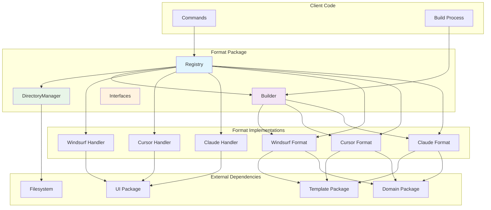
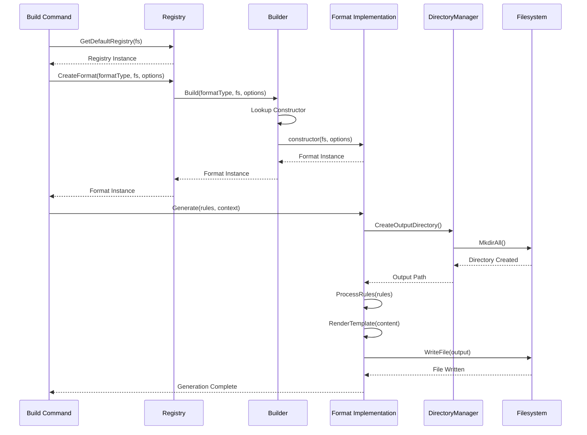
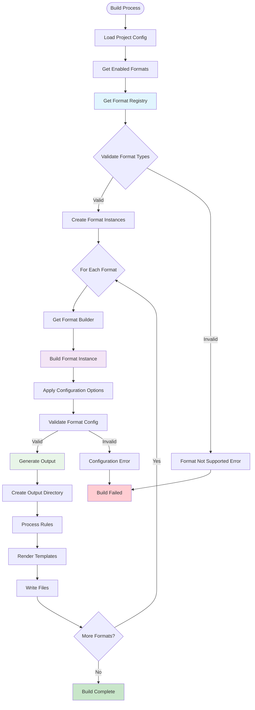

# Format Package

This package manages output format implementations for different AI assistant platforms, providing a registry system for format discovery, a builder pattern for format instantiation, and base utilities for format development.

## Purpose

The format package enables Contexture to generate output files tailored to specific AI assistant platforms (Claude, Cursor, Windsurf) while maintaining a consistent interface for format operations. It provides the infrastructure for format extensibility and management.

## Architecture

### Registry Pattern
- **Format Registry**: Central registry for discovering and managing available formats
- **Handler Interface**: UI integration for format selection and configuration
- **Dynamic Registration**: Support for runtime format registration and discovery

### Builder Pattern
- **Format Builder**: Factory for creating format implementations with configuration
- **Constructor Functions**: Type-safe format instantiation with validation
- **Options Support**: Flexible configuration through option maps

### Base Infrastructure
- **Common Interfaces**: Shared contracts for all format implementations
- **Directory Management**: Utilities for output directory creation and management
- **UI Integration**: Format-specific user interface components

### Registry and Builder Pattern

### Format Processing Flow

### Format Selection and Configuration

## Supported Formats

### Built-in Formats
- **Claude**: AI assistant format optimized for Claude's interface and capabilities
- **Cursor**: Code editor format tailored for Cursor's AI features
- **Windsurf**: Development environment format designed for Windsurf workflows

### Format Capabilities
- **Single/Multi-file Output**: Support for both single-file and directory-based outputs
- **File Extension Management**: Automatic file extension handling based on format type
- **Template Processing**: Integration with template engine for dynamic content generation
- **Configuration Validation**: Format-specific configuration validation and constraints

## Directory Management

- **Output Directory Creation**: Automatic creation of format-specific output directories
- **File Organization**: Structured organization of generated files
- **Path Resolution**: Intelligent path resolution for various output scenarios
- **Cleanup Support**: Utilities for managing generated file lifecycles

## Usage Within Project

This package is used by:
- **Commands Package**: Build command uses formats for output generation
- **Domain Package**: Format interfaces define contracts for format implementations
- **Project Package**: Configuration management includes format settings

## API

### Registry Operations
- `NewRegistry(fs)`: Creates format registry with filesystem support
- `GetDefaultRegistry(fs)`: Returns registry with all built-in formats
- `Register(formatType, handler)`: Adds format to registry
- `CreateFormat(type, fs, options)`: Creates format implementation

### Builder Operations
- `NewBuilder()`: Creates format builder with built-in formats
- `Register(type, constructor)`: Adds constructor function
- `Build(type, fs, options)`: Instantiates format with configuration
- `GetSupportedFormats()`: Lists available format types