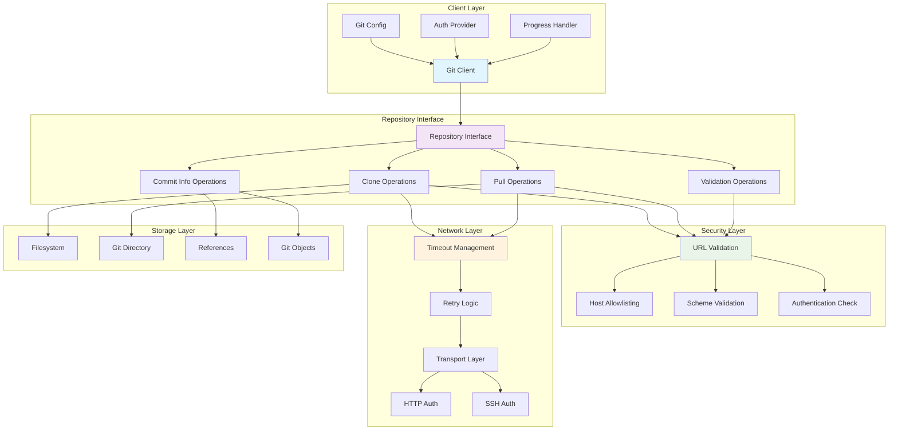
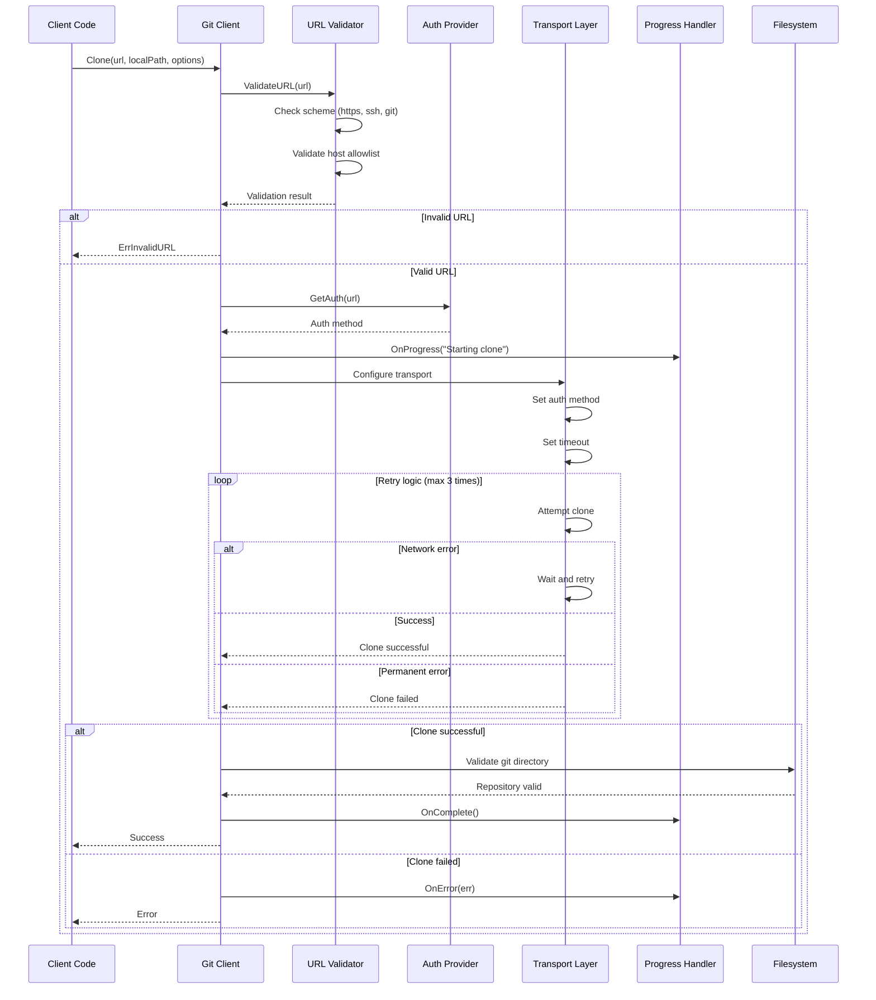

# Git Package

This package provides secure Git repository operations with comprehensive error handling, configurable timeouts, authentication management, and retry logic for robust repository interactions.

## Purpose

The git package abstracts Git operations behind a clean interface, handling the complexity of authentication, network issues, and repository management. It ensures secure, reliable access to Git repositories while providing detailed progress reporting and error recovery.

## Key Features

- **Secure Operations**: Comprehensive URL validation and host allowlisting
- **Authentication Support**: HTTP basic auth, SSH keys, and token-based authentication
- **Timeout Management**: Configurable timeouts for clone and pull operations
- **Retry Logic**: Automatic retry for transient network failures
- **Progress Reporting**: Real-time progress updates for long-running operations
- **Repository Validation**: Checks for valid Git repositories and remote URLs
- **Commit Information**: Retrieval of commit metadata and file history

## Security Features

- **URL Validation**: Strict validation of repository URLs and schemes
- **Host Allowlisting**: Configurable list of allowed Git hosts
- **Scheme Restrictions**: Support for HTTPS, HTTP, SSH, and git protocols only
- **Authentication Abstraction**: Pluggable authentication providers

## Operation Types

- **Clone**: Full repository cloning with branch/tag specification
- **Pull**: Updates to existing repositories with conflict resolution
- **Commit Info**: Retrieval of commit metadata and file-specific history
- **File Access**: Reading files at specific commits or branches
- **Repository Validation**: Checking repository validity and remote access

## Usage Within Project

This package is used by:
- **Cache Package**: Repository caching relies on git operations for clone and pull
- **Rule Package**: Git fetcher uses this package for repository-based rule retrieval
- **Integration Tests**: End-to-end testing uses git operations for test repositories

## Interface Design

The package follows Go interface conventions with a clean `Repository` interface that:
- Enables easy testing through mock implementations
- Supports different Git backends (go-git, system git, etc.)
- Provides consistent error handling across all operations
- Allows for progress monitoring and cancellation

### Git Operations Architecture

### Clone Operation Flow

### Authentication Flow

## API

- `NewClient(fs, config)`: Creates a new Git client with filesystem and configuration
- Repository interface includes `Clone()`, `Pull()`, `GetLatestCommitHash()`, `ValidateURL()`
- Configuration supports timeouts, authentication, progress handlers, and security settings