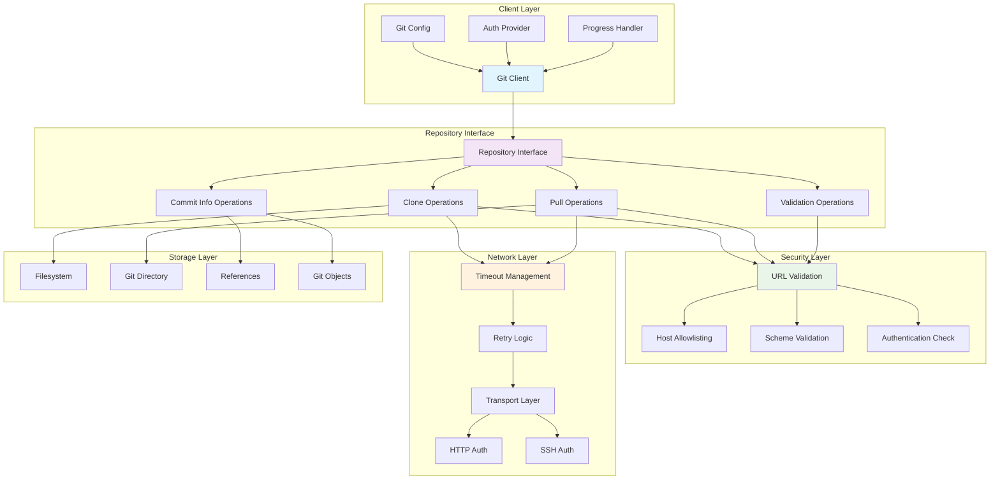
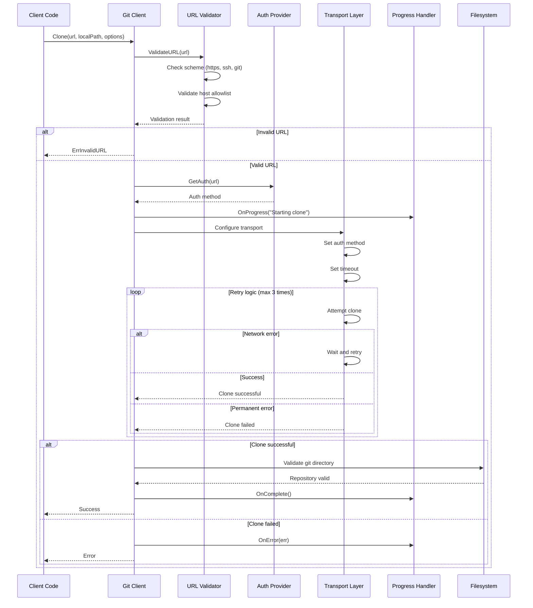
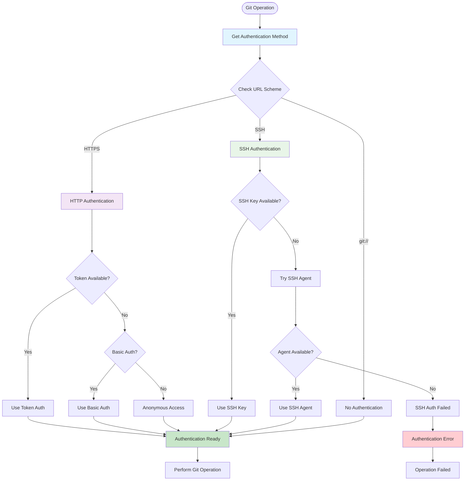

# Git Package

This package provides an interface for Git repository operations, including cloning, pulling, and retrieving commit information. It includes features for security, authentication, and error handling.

## Features

- **Secure Operations**: Enforces URL validation and a configurable host allowlist.
- **Authentication**: Supports HTTP basic auth, SSH keys, and token-based authentication.
- **Resilience**: Implements configurable timeouts and automatic retries for transient network failures.
- **Progress Reporting**: Provides real-time progress updates for long-running operations like `clone` and `pull`.
- **Repository Validation**: Includes functions to check for valid Git repositories and remote URLs.
- **Commit Information**: Allows for retrieval of commit metadata and file history.

## Usage

This package is used by:
- `cache` package: For cloning and pulling repositories for caching.
- `rule` package: For fetching rules from Git repositories.

## Interface Design

The core of the package is the `Repository` interface, which abstracts Git operations. This design allows for mock implementations in tests and supports different backend Git libraries.

### Git Operations Architecture

### Clone Operation Flow

### Authentication Flow

## API

- `NewClient(fs, config) -> Client`: Creates a new Git client.
- The `Repository` interface provides methods such as `Clone()`, `Pull()`, `GetLatestCommitHash()`, and `ValidateURL()`.
- The configuration struct allows for setting timeouts, authentication methods, progress handlers, and security options.