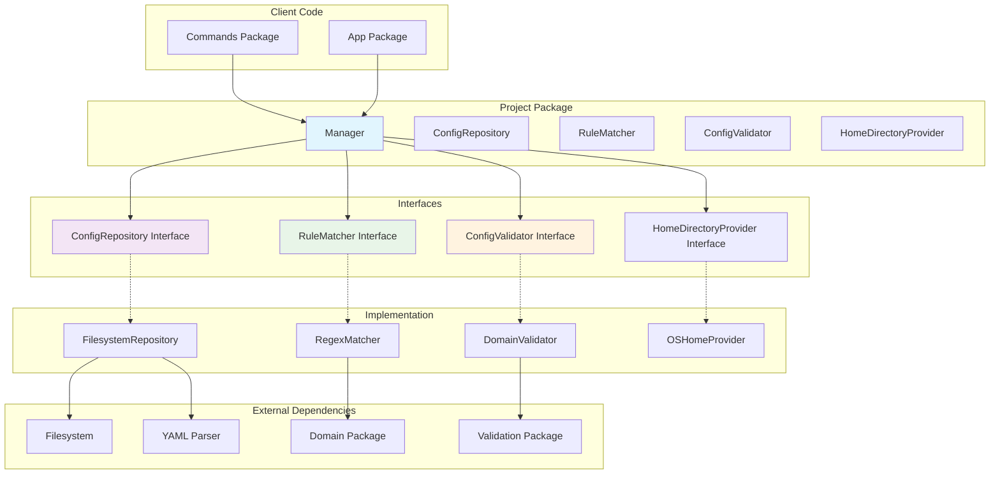
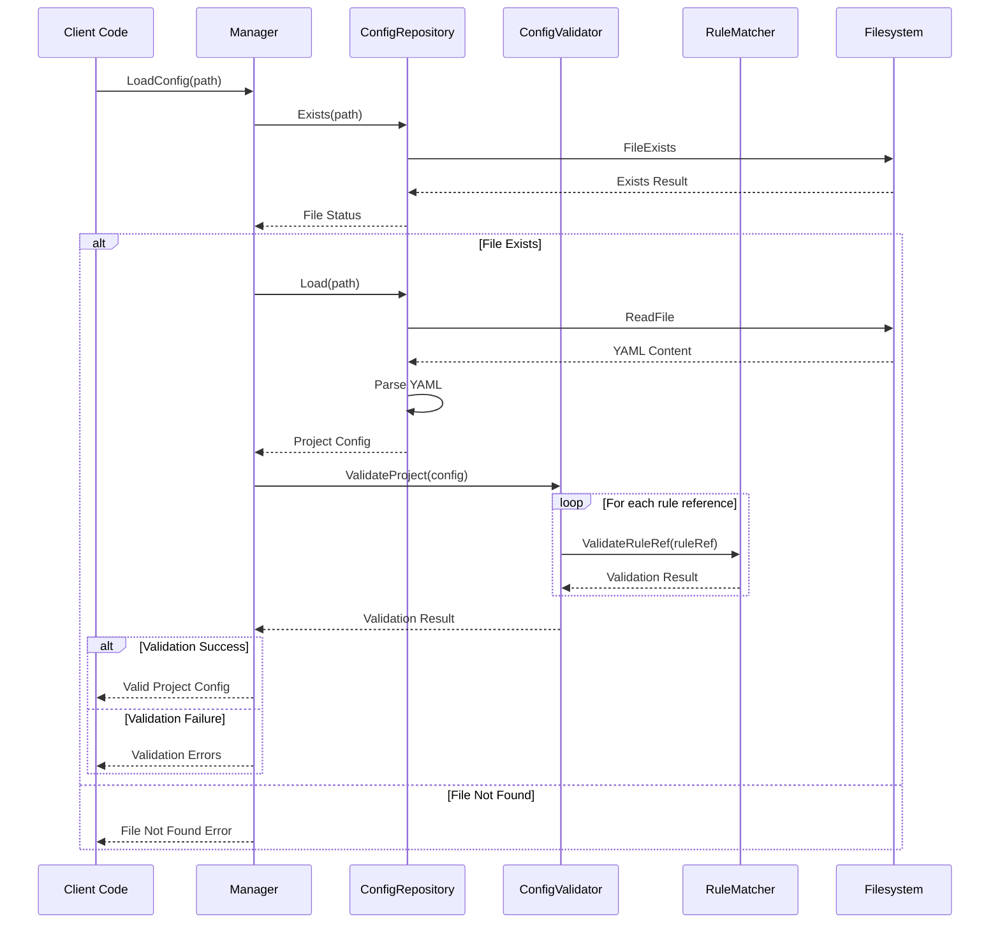
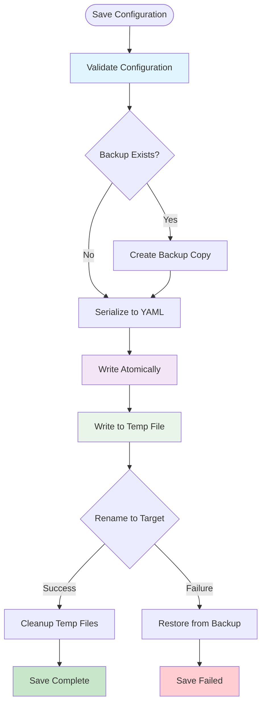

# Project Package

This package provides comprehensive project configuration management for the Contexture CLI, implementing the Repository pattern to handle configuration persistence, rule matching, and validation operations.

## Purpose

The project package manages all aspects of Contexture project configuration, from loading and saving configuration files to validating project structure and matching rule references. It serves as the bridge between the CLI commands and the underlying configuration data.

## Architecture

The package follows clean architecture principles with distinct interfaces:
- **ConfigRepository**: Handles file I/O operations and configuration persistence
- **RuleMatcher**: Manages rule ID parsing and pattern matching logic
- **ConfigValidator**: Validates project configuration and rule references
- **Manager**: High-level orchestration of configuration operations

### Repository Pattern Architecture

### Configuration Loading and Validation Flow

### Rule ID Matching Logic

### Configuration Persistence Flow

## Key Features

- **Atomic Configuration Updates**: Safe configuration saving with atomic file operations
- **Rule ID Matching**: Sophisticated pattern matching for different rule ID formats
- **Path Extraction**: Parsing of complex rule reference formats including contexture-specific patterns
- **Validation Integration**: Deep validation of project structure and rule constraints
- **Thread Safety**: All operations are safe for concurrent use
- **Home Directory Support**: Automatic resolution of home directory paths

## Configuration Management

- **YAML-Based**: Project configurations stored as YAML files
- **Schema Validation**: Strict validation of configuration structure and content
- **Format Management**: Validation of output format configurations
- **Rule Uniqueness**: Ensures unique rule IDs across project configurations

## Rule Matching Logic

The package handles complex rule ID formats:
- Simple rule IDs (e.g., `my-rule`)
- Full contexture format (e.g., `[contexture:path/to/rule]`)
- Repository-based format (e.g., `[contexture(source):path,branch]`)
- Path extraction from formatted rule references

## Usage Within Project

This package is used by:
- **Commands Package**: All configuration-related CLI commands use this package
- **App Package**: Application initialization loads project configuration
- **Validation Package**: Project validation delegates to this package's validators

## API

- `NewManager(fs)`: Creates a project manager with filesystem dependencies
- `LoadConfig(path)`: Loads and validates project configuration from file
- `SaveConfig(config, path)`: Atomically saves configuration to file
- `MatchRule(ruleID, targetID)`: Determines if rule IDs match across different formats
- `ExtractPath(ruleID)`: Extracts file path from formatted rule references