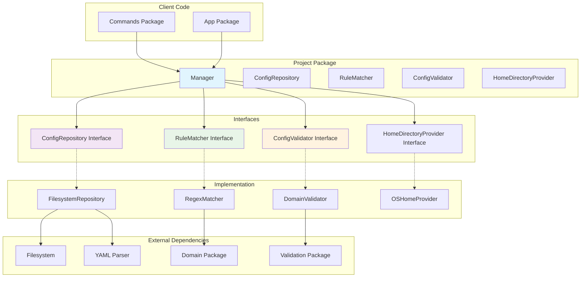
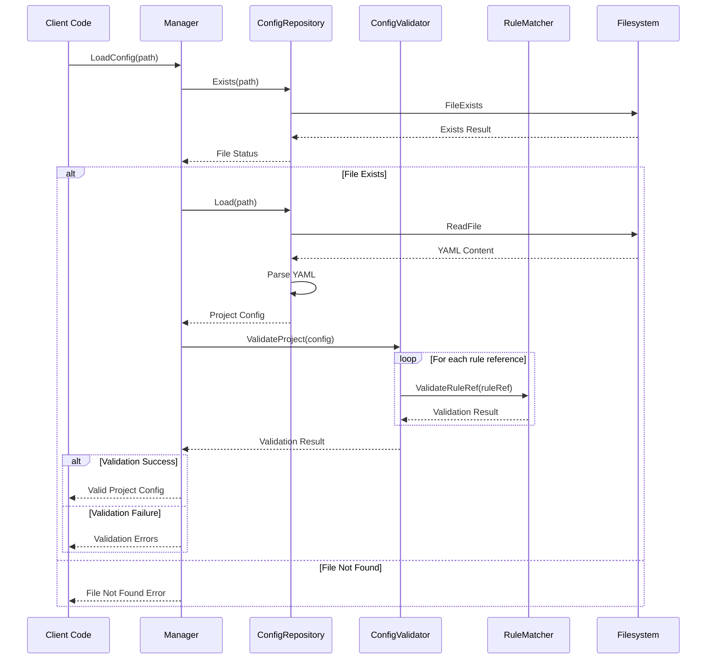
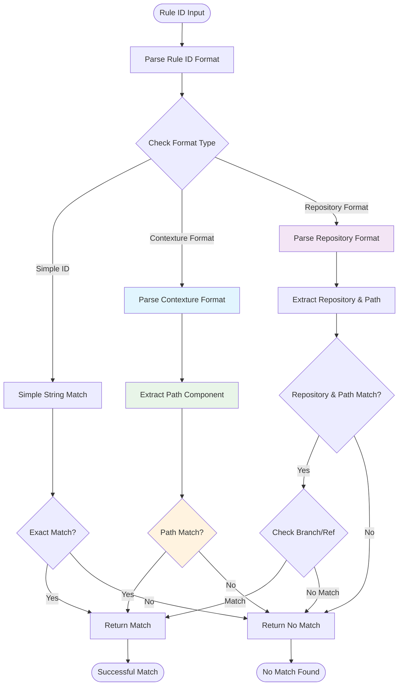

# Project Package

This package manages project configurations. It uses a repository pattern to handle configuration persistence, rule matching, and validation.

## Architecture

The package is designed with a clean architecture, using interfaces for its core components:
- **`ConfigRepository`**: Handles loading and saving configuration files.
- **`RuleMatcher`**: Implements logic for parsing and matching rule IDs.
- **`ConfigValidator`**: Validates the project configuration and rule references.
- **`Manager`**: Orchestrates the configuration operations.

### Repository Pattern Architecture

### Configuration Loading and Validation Flow

### Rule ID Matching Logic

### Configuration Persistence Flow

## Features

- **Atomic Configuration Updates**: Ensures safe configuration saving with atomic file operations.
- **Rule ID Matching**: Supports pattern matching for various rule ID formats (simple, contexture, and repository-based).
- **Path Extraction**: Parses complex rule references to extract file paths.
- **Validation Integration**: Provides deep validation of project structure and rule constraints.
- **Home Directory Support**: Automatically resolves home directory paths (e.g., `~/`).

## Usage

This package is used by:
- The `commands` package for all configuration-related CLI commands.
- The `app` package for loading the project configuration on initialization.

## API

- `NewManager(fs) -> Manager`: Creates a new project manager.
- `LoadConfig(path) -> *Project`: Loads and validates a project configuration from a file.
- `SaveConfig(config, path) -> error`: Atomically saves a configuration to a file.
- `MatchRule(ruleID, targetID) -> bool`: Checks if two rule IDs match, accounting for different formats.
- `ExtractPath(ruleID) -> string`: Extracts the file path from a formatted rule reference.