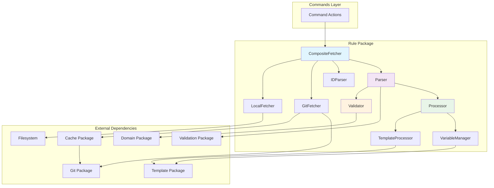
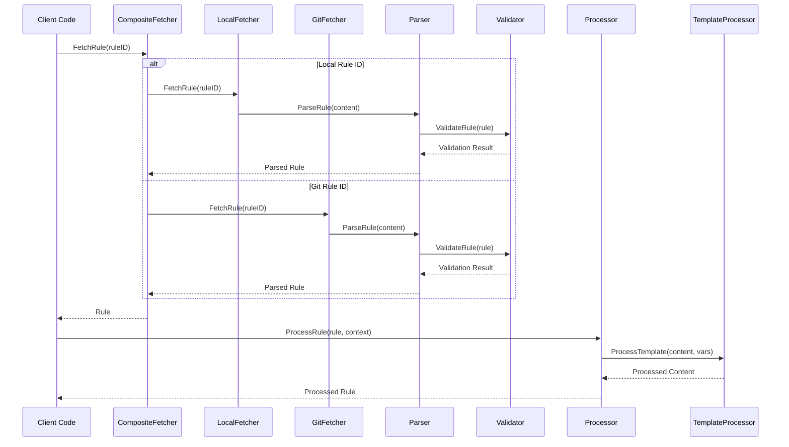
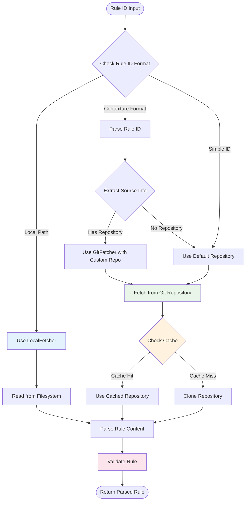

# Rule Package

This package provides comprehensive rule processing functionality for Contexture, implementing a modular architecture with separate components for fetching, parsing, processing, and validating rules from various sources.

## Purpose

The rule package serves as the core engine for rule management, handling everything from retrieving rules from local files or Git repositories to processing templates and validating rule structure. It provides a clean interface for rule operations while supporting multiple data sources and processing requirements.

## Architecture

### Component-Based Design
- **Fetcher**: Retrieves rules from local files and Git repositories with intelligent caching
- **Parser**: Processes rule content including frontmatter parsing and metadata extraction
- **Processor**: Handles template processing, variable substitution, and context management
- **Validator**: Validates rule structure, content, and business logic constraints

### Rule Sources
- **Local Files**: Direct access to filesystem-based rules for development workflows
- **Git Repositories**: Remote rule fetching with repository caching and branch/commit support
- **Composite Fetching**: Intelligent routing between local and Git sources based on rule ID format

### Component Interaction Diagram

### Rule Processing Pipeline

### Fetching Strategy Flow

## Key Features

- **Multi-Source Support**: Seamless handling of both local and remote rule sources
- **Template Processing**: Dynamic content generation using Go templates with custom functions
- **Variable Management**: Context-aware variable substitution and dependency tracking
- **Repository Caching**: Efficient Git repository caching for improved performance
- **Rule ID Parsing**: Sophisticated parsing of complex rule reference formats
- **Attribution Generation**: Automatic attribution information for rule sources and metadata

## Rule Processing Pipeline

1. **Fetching**: Retrieve rule content from configured sources
2. **Parsing**: Extract frontmatter metadata and rule body content
3. **Validation**: Verify rule structure and business rule compliance
4. **Processing**: Apply template processing with variable context
5. **Attribution**: Generate source attribution for tracking and compliance

## Rule ID Formats

The package supports various rule ID formats:
- Simple paths: `path/to/rule.md`
- Contexture format: `[contexture:path/to/rule]`
- Repository format: `[contexture(repo-url):path,branch]`
- Local references: Direct filesystem paths

## Usage Within Project

This package is used by:
- **Commands Package**: All rule-related CLI commands use this package for rule operations
- **Format Package**: Rule processing provides processed rules for format generation
- **Build System**: Template processing and rule compilation for output generation

## API

### Core Interfaces
- `Fetcher`: `FetchRule()`, `FetchRules()`, `ParseRuleID()`, `ListAvailableRules()`
- `Parser`: `ParseRule()`, `ParseContent()`, `ValidateRule()`
- `Processor`: `ProcessRule()`, `ProcessRules()`, `ProcessTemplate()`, `GenerateAttribution()`

### Factory Functions
- `NewFetcher(fs, repository, config)`: Creates composite fetcher with Git and local support
- `NewParser()`: Creates rule parser with frontmatter support
- `NewProcessor(templateEngine, validator)`: Creates rule processor with template engine