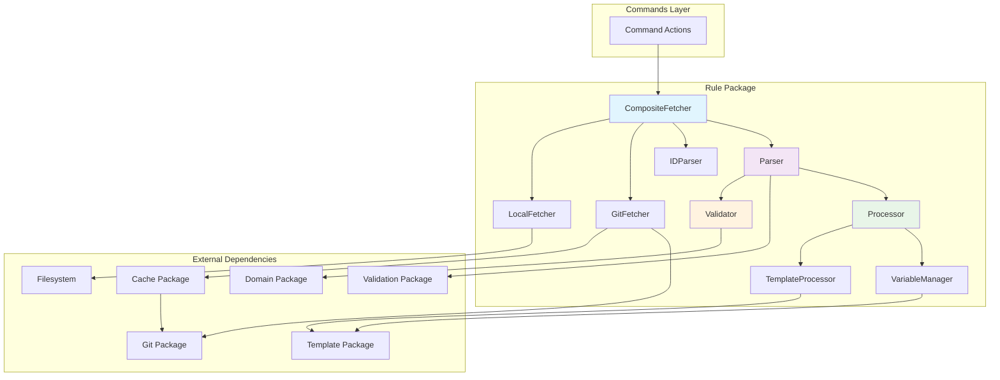
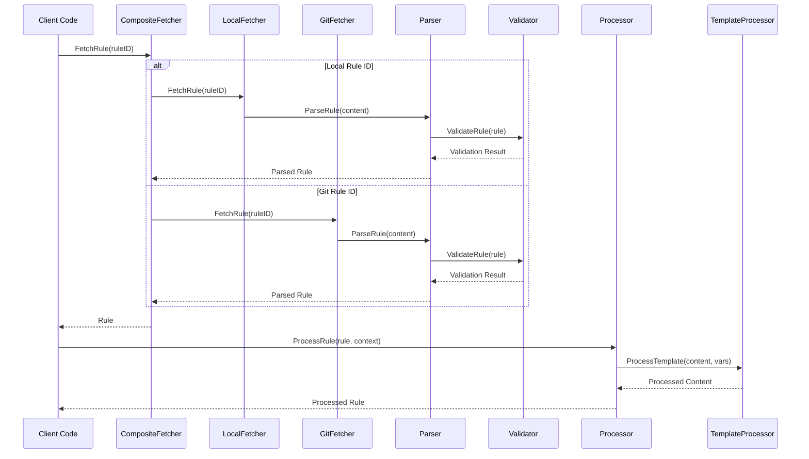

# Rule Package

This package handles rule processing, including fetching, parsing, and validating rules from various sources.

## Architecture

The package is designed with a component-based architecture:
- **Fetcher**: A composite fetcher that retrieves rules from local files or Git repositories, with support for caching.
- **Parser**: Parses rule content, extracting frontmatter and metadata.
- **Processor**: Processes templates, substitutes variables, and manages context.
- **Validator**: Validates the rule's structure, content, and business logic.

### Component Interaction Diagram

### Rule Processing Pipeline

### Fetching Strategy Flow

## Features

- **Multi-Source Support**: Handles rules from both local files and remote Git repositories.
- **Template Processing**: Uses Go templates with custom functions for dynamic content generation.
- **Variable Management**: Supports context-aware variable substitution.
- **Repository Caching**: Caches Git repositories for improved performance.
- **Rule ID Parsing**: Parses various rule ID formats.
- **Attribution Generation**: Automatically generates attribution for rule sources.

## Usage

This package is used by:
- The `commands` package for all rule-related operations.
- The `format` package, which uses processed rules to generate output.

## API

- **Interfaces**: Provides `Fetcher`, `Parser`, and `Processor` interfaces.
- **Factory Functions**: `NewFetcher()`, `NewParser()`, and `NewProcessor()` for creating instances of the components.