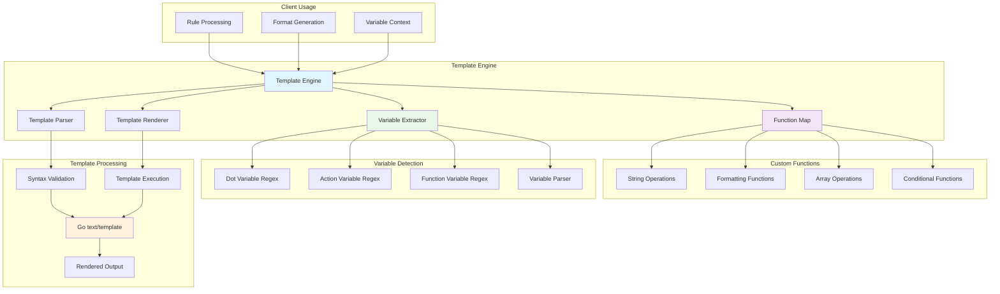
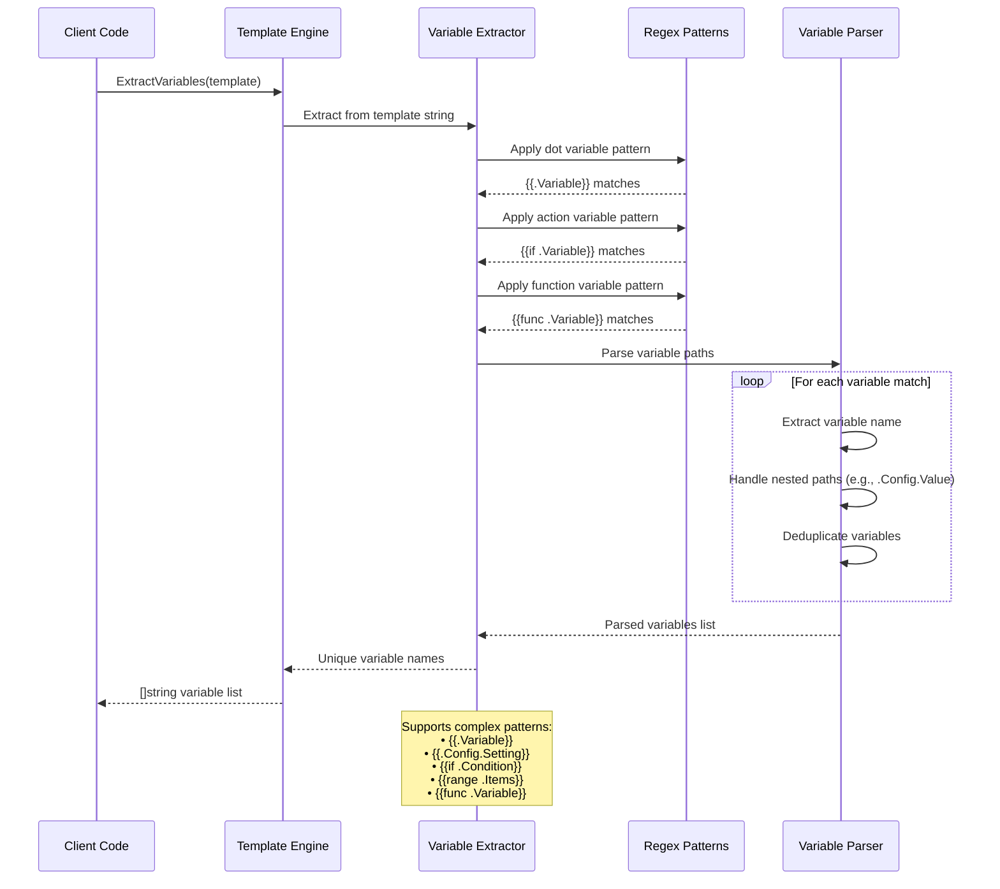

# Template Package

This package provides a markdown-safe text template processing engine. It wraps Go's `text/template` package and extends it with custom functions for string manipulation, formatting, and variable extraction.

## Features

- **Markdown-Safe Rendering**: Uses `text/template` to avoid HTML escaping, making it safe for generating markdown.
- **Custom Function Library**: Includes a rich set of functions for string manipulation, formatting, and array operations.
- **Variable Extraction**: Automatically detects template variables (e.g., `{{.Variable}}`) for validation and dependency analysis.
- **Template Validation**: Provides functions to check template syntax and parse errors before rendering.

## Variable Detection

The engine can extract variables from various constructs, including:
- **Dot Variables**: `{{.Variable}}`
- **Actions**: `{{if .Variable}}`, `{{range .Items}}`
- **Function Calls**: `{{someFunc .Variable}}`
- **Nested Paths**: `{{.Config.Setting.Value}}`

### Template Processing Pipeline

### Template Engine Architecture

### Variable Extraction Process

## Usage

This package is used by:
- `rule` package: For rendering rule content.
- `format` package: For generating formatted output.

## API

- `NewEngine() -> Engine`: Creates a new template engine with all custom functions registered.
- `Render(template, vars) -> string`: Renders a template with the given variables.
- `ParseAndValidate(template) -> error`: Validates the template syntax without rendering it.
- `ExtractVariables(template) -> []string`: Returns a list of all variables referenced in the template.