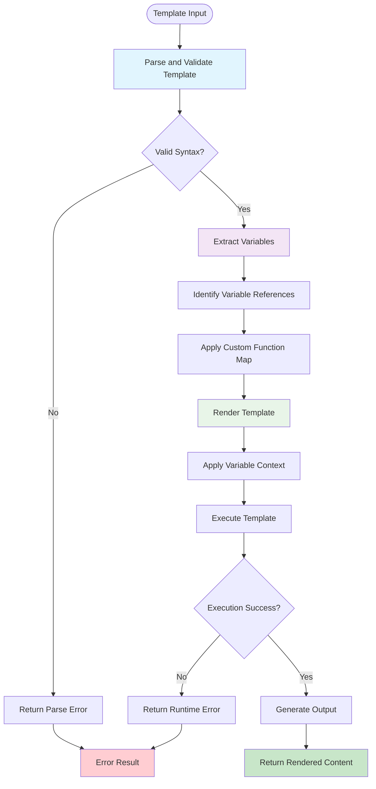
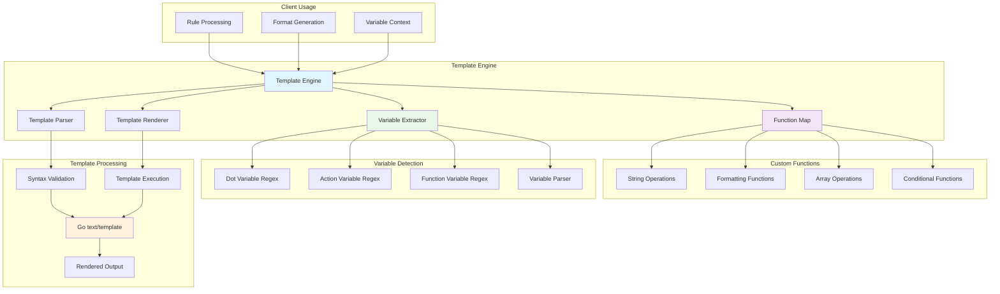
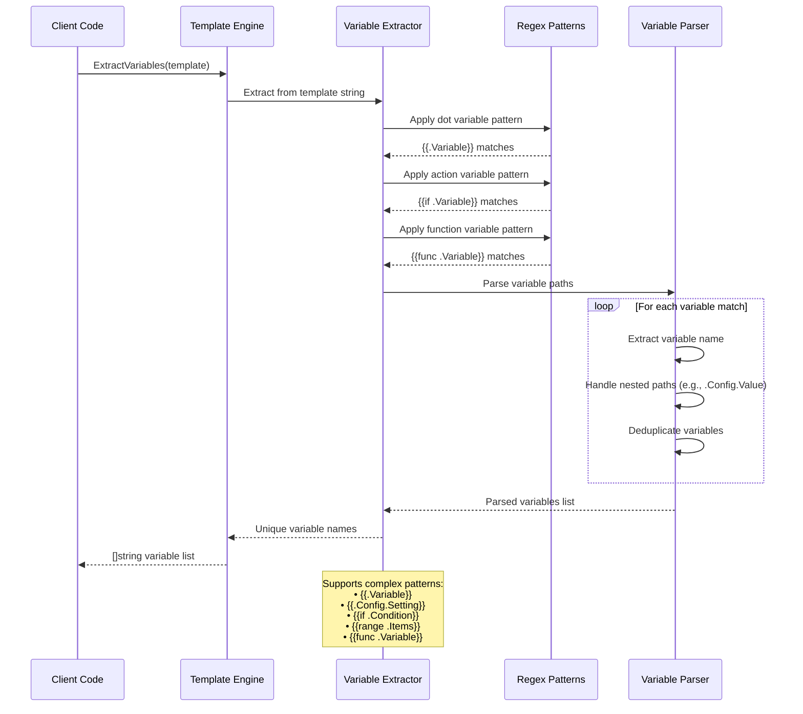

# Template Package

This package provides markdown-safe text template processing functionality for Contexture, wrapping Go's text/template with custom functions for string manipulation, formatting, and variable extraction.

## Purpose

The template package enables dynamic content generation within Contexture rules by processing Go-style templates with contextual variables. It provides a rich set of template functions while maintaining safety for markdown output by avoiding HTML escaping.

## Key Features

- **Markdown-Safe Rendering**: Uses text/template instead of html/template to prevent HTML escaping
- **Custom Function Library**: Extended set of functions for string manipulation, formatting, and array operations
- **Variable Extraction**: Automatic detection of template variables for validation and dependency analysis
- **Template Validation**: Syntax checking and parsing validation before rendering
- **Thread-Safe Operations**: Each render operation uses isolated template instances
- **Performance Optimization**: Pre-compiled regex patterns for efficient variable detection

## Template Functions

The package provides custom template functions including:
- **String Operations**: Case conversion, formatting, and manipulation functions
- **Formatting**: Text formatting and output styling functions  
- **Array Operations**: List processing and iteration helpers
- **Conditional Logic**: Enhanced conditional processing beyond standard Go templates

## Variable Detection

Advanced variable extraction capabilities:
- **Dot Variables**: Detection of `{{.Variable}}` patterns with nested field access
- **Action Variables**: Parsing of `{{if .Variable}}`, `{{range .Items}}` constructs
- **Function Variables**: Recognition of function calls that reference variables
- **Nested Access**: Support for complex variable paths like `{{.Config.Setting.Value}}`

### Template Processing Pipeline

### Template Engine Architecture

### Variable Extraction Process

## Template Safety

- **Text-Only Output**: No HTML escaping ensures clean markdown generation
- **Safe Function Set**: All custom functions are designed for text output
- **Error Handling**: Comprehensive error reporting for template issues
- **Validation First**: Parse and validate before rendering to catch issues early

## Usage Within Project

This package is used by:
- **Rule Package**: Template processor uses this engine for rule content rendering
- **Format Package**: Various format implementations use templates for output generation

## API

- `NewEngine()`: Creates a template engine with all custom functions registered
- `Render(template, variables)`: Processes template with provided variable context
- `ParseAndValidate(template)`: Validates template syntax without rendering
- `ExtractVariables(template)`: Returns list of all variables referenced in template