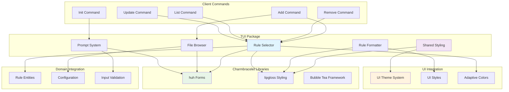
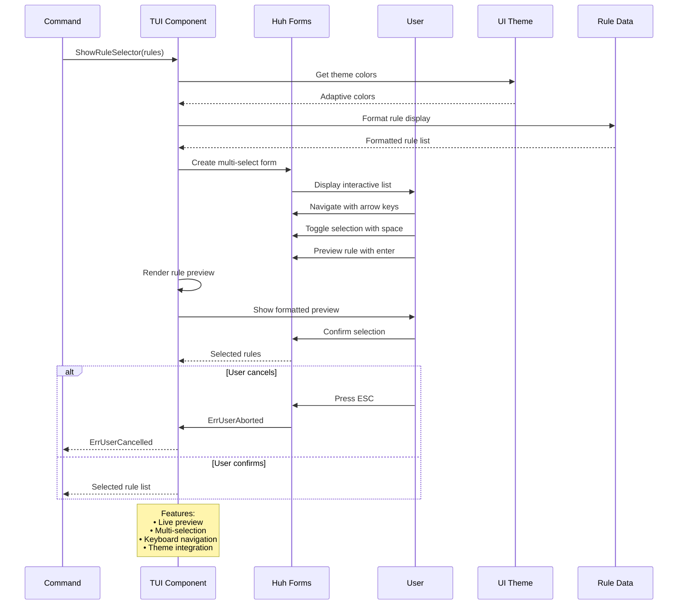
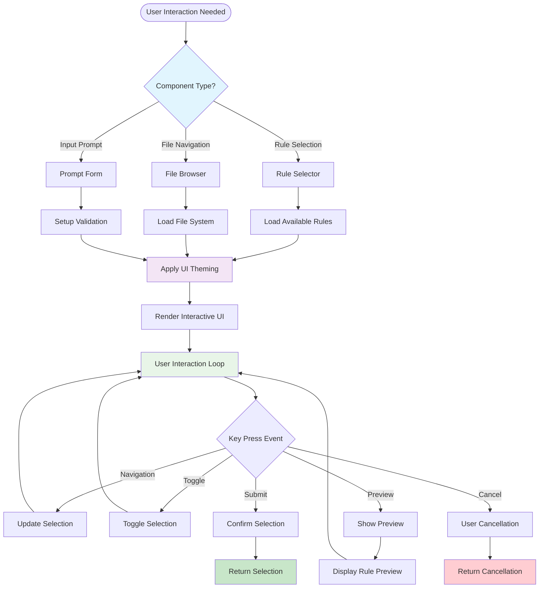

# TUI Package

The `tui` package provides terminal user interface components for interactive command-line experiences. It uses the `charmbracelet` UI library ecosystem to implement UI elements like rule selectors, file browsers, and prompts.

## Key Components & Features

- **Rule Selector**: A multi-selection interface for choosing rules, with a real-time preview panel. Supports keyboard navigation and clear visual feedback for selections.
- **File Browser**: A component for navigating and selecting files from the filesystem.
- **Prompt System**: A system for creating configurable user input prompts with validation.
- **Visual Rendering**: Provides rich formatting for rule previews, including syntax highlighting and metadata. It uses a shared styling system with adaptive colors for light and dark terminal themes.
- **Layouts**: Responsive layouts that adapt to different terminal sizes.

## Integration

The TUI components integrate with other internal packages:
- **`ui` package**: For a consistent theme, styles, and adaptive colors across all components.
- **`commands` package**: The interactive commands use TUI components for user selections and input.

### TUI Component Architecture

### Interactive Selection Flow

### Component Integration Pattern

## Charmbracelet Integration

This package is built on the charmbracelet ecosystem:
- **`huh`**: For form and prompt components.
- **`lipgloss`**: For styling and layout.

## API

The package exposes the following main components:

- `RuleSelector`: A multi-selection component with preview capabilities.
- `FileBrowser`: A file system navigation and selection component.
- `SelectOptions`: A configurable selection prompt with validation.

It also provides rendering and styling utilities.

## Error Handling

- `HandleFormError(err)`: A function to convert `charmbracelet/huh` errors into user-friendly messages.
- `ErrUserCancelled`: A standard error returned when the user cancels an operation (e.g., by pressing ESC).