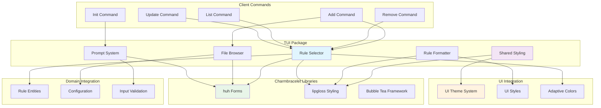
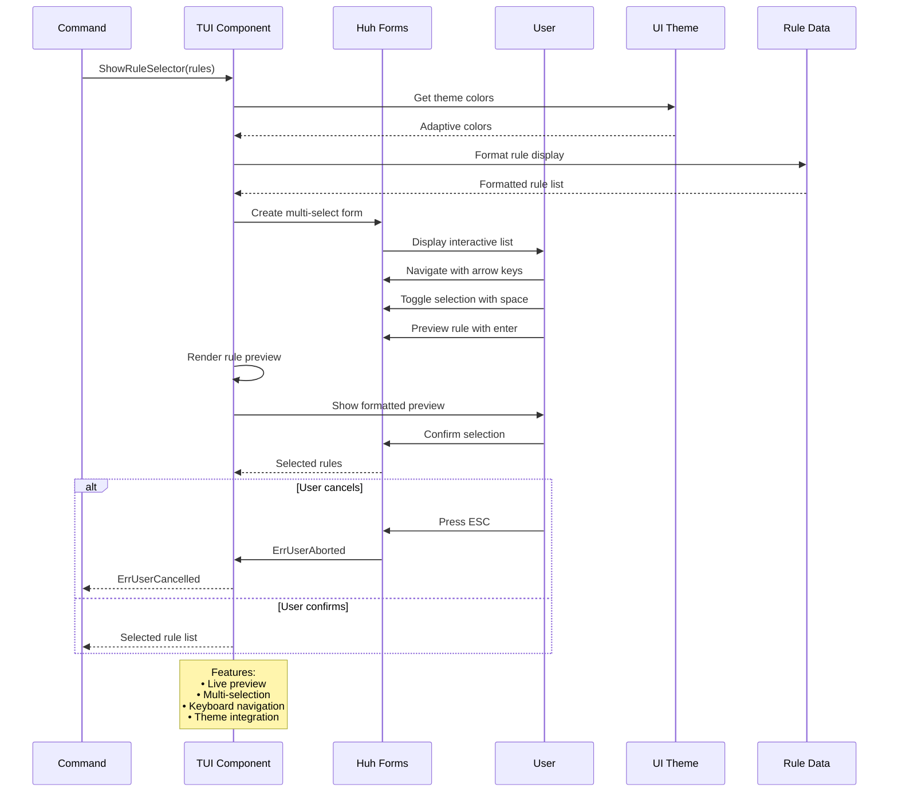

# TUI Package

This package provides terminal user interface components for interactive user experiences in Contexture, implementing rich UI elements like rule selectors, file browsers, and prompts using the charmbracelet UI library ecosystem.

## Purpose

The tui package bridges the gap between the command-line interface and user-friendly interactive experiences. It provides sophisticated terminal UI components that make rule selection, file browsing, and user input both intuitive and visually appealing.

## Key Components

### Interactive Selectors
- **Rule Selector**: Multi-selection interface for choosing rules with preview capabilities
- **File Browser**: Navigate and select files from the filesystem with visual hierarchy
- **Prompt System**: Configurable prompts for user input with validation and error handling

### Visual Rendering
- **Rule Preview**: Rich formatting for rule content with syntax highlighting and metadata
- **Shared Styling**: Consistent visual styling across all TUI components
- **Adaptive Colors**: Theme-aware colors that adapt to light/dark terminal environments

## User Experience Features

- **Real-Time Preview**: Live preview of rules during selection process
- **Keyboard Navigation**: Full keyboard support with intuitive navigation patterns
- **Visual Feedback**: Clear indication of selection state and user actions
- **Error Handling**: Graceful handling of user cancellation and input errors
- **Responsive Layout**: Adaptive layouts that work across different terminal sizes

## Integration with UI System

- **Theme Integration**: Seamless integration with the internal UI theme system
- **Consistent Styling**: Unified visual language across all interactive components  
- **Icon Usage**: Contextual icons and visual indicators for enhanced usability
- **Color Coordination**: Coordinated color usage for status, selection, and emphasis

### TUI Component Architecture

### Interactive Selection Flow

### Component Integration Pattern

## Charmbracelet Integration

Built on the charmbracelet ecosystem:
- **huh**: Form and prompt components for user interaction
- **lipgloss**: Styling and layout system for terminal rendering
- **Shared Patterns**: Common patterns for terminal UI development

## Usage Within Project

This package is used by:
- **Commands Package**: Interactive commands use TUI components for user selection and input
- **Rule Selection**: Commands that require rule selection use the rule selector component
- **Configuration**: Interactive configuration commands use prompts and selectors

## API

### Selection Components
- `RuleSelector`: Multi-selection interface with preview capabilities
- `FileBrowser`: File system navigation with selection support
- `SelectOptions`: Configurable selection prompts with validation

### Rendering Utilities
- Shared styling functions for consistent visual presentation
- Rule rendering utilities with formatting and metadata display
- Color and theme management for adaptive terminal environments

### Error Handling
- `HandleFormError(err)`: Converts library errors to user-friendly messages
- `ErrUserCancelled`: Standard error for user-initiated cancellation
- Graceful degradation for unsupported terminal features