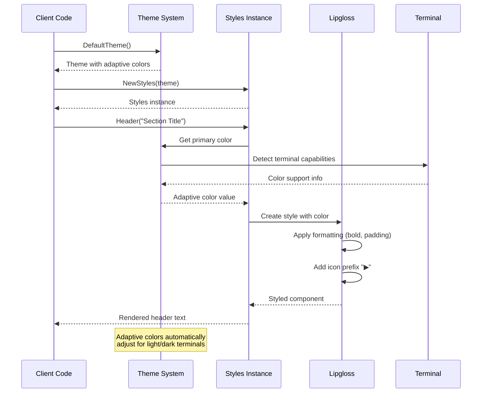
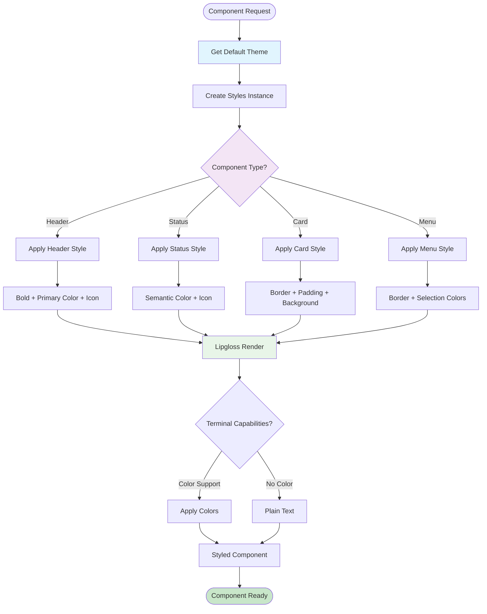

# UI Package

This package provides a centralized theming and styling system for all user interface components in the application. It uses the `lipgloss` framework to create a consistent visual design with adaptive colors.

## Theming System

- **Adaptive Colors**: Automatically detects and adjusts for light/dark terminal themes.
- **Semantic Colors**: Maps colors to meanings such as `success`, `error`, `warning`, and `info`.
- **Consistent Palette**: Uses a coordinated color scheme for a consistent appearance.
- **Terminal Compatibility**: Provides graceful fallbacks for terminals with limited color support.

## Component Library

The package includes a library of pre-styled components:

- **Text Components**: `Headers`, `Status Messages` (Success, Warning, Error, Info), and `Body Text`.
- **Layout Components**: `Cards` for bordered content, `Dividers`, and `Sidebars`.
- **Utility Components**: `Loading Indicators`, `Banners`, and `Status Indicators`.

## Icon System

A consistent set of icons is used across all components for statuses and navigation, including:
- **Status Icons**: `✓` (success), `✗` (error), `⚠` (warning), `ⓘ` (info)
- **Navigation Icons**: `▶` (expand), `◀` (collapse)

### UI Component Hierarchy

```mermaid
graph TB
    subgraph "Theme System"
        THEME[Default Theme]
        STYLES[Styles Instance]
        ADAPTIVE[Adaptive Colors]
        LIPGLOSS[Lipgloss Framework]
    end
    
    subgraph "Text Components"
        HEADER[Header Component]
        SUCCESS[Success Message]
        ERROR[Error Message]
        WARNING[Warning Message]
        INFO[Info Message]
        MUTED[Muted Text]
    end
    
    subgraph "Layout Components"
        CARD[Card Container]
        DIVIDER[Divider Separator]
        SIDEBAR[Sidebar Panel]
        BANNER[Banner Message]
    end
    
    subgraph "Interactive Components"
        MENU[Menu Interface]
        PROGRESS[Progress Bar]
        NOTIFICATION[Notification]
        LOADING[Loading Indicator]
        STATUS[Status Indicator]
    end
    
    subgraph "Client Integration"
        TUI[TUI Package]
        CLI[CLI Package]
        COMMANDS[Commands Package]
        FORMAT[Format Package]
    end
    
    THEME --> STYLES
    STYLES --> ADAPTIVE
    ADAPTIVE --> LIPGLOSS
    
    STYLES --> HEADER
    STYLES --> SUCCESS
    STYLES --> ERROR
    STYLES --> WARNING
    STYLES --> INFO
    STYLES --> MUTED
    
    STYLES --> CARD
    STYLES --> DIVIDER
    STYLES --> SIDEBAR
    STYLES --> BANNER
    
    STYLES --> MENU
    STYLES --> PROGRESS
    STYLES --> NOTIFICATION
    STYLES --> LOADING
    STYLES --> STATUS
    
    TUI --> HEADER
    TUI --> SUCCESS
    TUI --> CARD
    TUI --> MENU
    
    CLI --> SUCCESS
    CLI --> ERROR
    CLI --> WARNING
    CLI --> INFO
    
    COMMANDS --> SUCCESS
    COMMANDS --> ERROR
    COMMANDS --> PROGRESS
    COMMANDS --> STATUS
    
    FORMAT --> BANNER
    FORMAT --> DIVIDER
    
    style THEME fill:#e1f5fe
    style STYLES fill:#f3e5f5
    style LIPGLOSS fill:#e8f5e8
    style TUI fill:#fff3e0
```

### Theme Application Flow

### Component Styling System

## Lipgloss Integration

This package is built on the `lipgloss` styling framework, using it for:
- **Style Composition**: Creating reusable style definitions.
- **Layout**: Managing padding, margins, and alignment.
- **Color Management**: Handling adaptive colors.

## Usage

This package is used by:
- `tui` package: For theming interactive components.
- `cli` package: For styling help and command output.
- `commands` package: For formatting command output and status messages.

## API

- `DefaultTheme() -> Theme`: Returns the default adaptive theme.
- `NewStyles(theme) -> Styles`: Creates a `Styles` instance with rendering functions based on the provided theme.
- **Styled Text Functions**: `Header(text)`, `Success(text)`, `Error(text)`, etc., which return styled strings with appropriate icons and colors.
- **Component Functions**: Functions for creating card, divider, and other UI components.