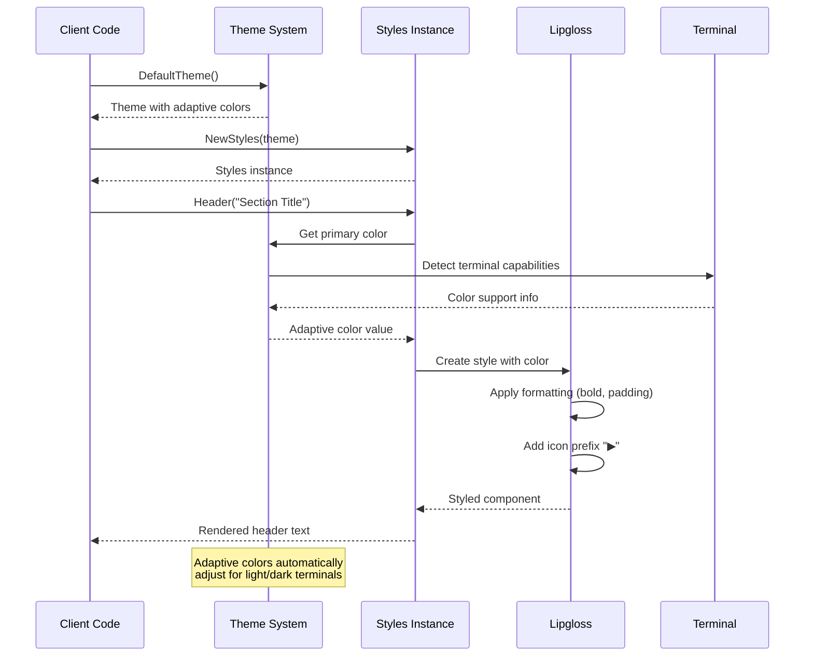

# UI Package

This package provides the core user interface theming and styling system for Contexture, implementing a comprehensive component library with adaptive colors and consistent visual design using the lipgloss styling framework.

## Purpose

The ui package establishes the visual foundation for all user-facing components in Contexture. It provides a unified theming system, pre-styled components, and consistent visual patterns that create a cohesive user experience across the entire CLI application.

## Adaptive Theming System

### Theme Architecture
- **Adaptive Colors**: Automatic light/dark theme detection and color adjustment
- **Semantic Color Mapping**: Colors mapped to semantic meanings (success, error, warning, info)
- **Consistent Palette**: Coordinated color scheme based on CharmTheme for consistency
- **Terminal Compatibility**: Graceful fallbacks for terminals with limited color support

### Color Categories
- **Status Colors**: Success, error, warning, and info indicators
- **Interface Colors**: Primary, secondary, background, foreground, and border colors
- **Special Colors**: Update notifications and muted text styling
- **Interactive Colors**: Selection and focus state colors

## Component Library

### Text Components
- **Headers**: Styled section headers with icon prefixes and consistent spacing
- **Status Messages**: Success, warning, error, and info messages with appropriate icons
- **Body Text**: Regular content text with proper contrast and readability

### Layout Components
- **Cards**: Bordered content containers with padding and styling
- **Dividers**: Visual separators with consistent styling and spacing
- **Sidebars**: Navigation and information panels with structured layout

### Interactive Components
- **Menus**: Styled menu interfaces with selection and navigation support
- **Progress Bars**: Visual progress indicators for long-running operations
- **Notifications**: Temporary status messages with appropriate styling

### Utility Components
- **Loading Indicators**: Animated loading states for async operations
- **Banners**: Prominent messages and announcements with emphasis styling
- **Status Indicators**: Compact status displays with color coding

### UI Component Hierarchy

```mermaid
graph TB
    subgraph "Theme System"
        THEME[Default Theme]
        STYLES[Styles Instance]
        ADAPTIVE[Adaptive Colors]
        LIPGLOSS[Lipgloss Framework]
    end
    
    subgraph "Text Components"
        HEADER[Header Component]
        SUCCESS[Success Message]
        ERROR[Error Message]
        WARNING[Warning Message]
        INFO[Info Message]
        MUTED[Muted Text]
    end
    
    subgraph "Layout Components"
        CARD[Card Container]
        DIVIDER[Divider Separator]
        SIDEBAR[Sidebar Panel]
        BANNER[Banner Message]
    end
    
    subgraph "Interactive Components"
        MENU[Menu Interface]
        PROGRESS[Progress Bar]
        NOTIFICATION[Notification]
        LOADING[Loading Indicator]
        STATUS[Status Indicator]
    end
    
    subgraph "Client Integration"
        TUI[TUI Package]
        CLI[CLI Package]
        COMMANDS[Commands Package]
        FORMAT[Format Package]
    end
    
    THEME --> STYLES
    STYLES --> ADAPTIVE
    ADAPTIVE --> LIPGLOSS
    
    STYLES --> HEADER
    STYLES --> SUCCESS
    STYLES --> ERROR
    STYLES --> WARNING
    STYLES --> INFO
    STYLES --> MUTED
    
    STYLES --> CARD
    STYLES --> DIVIDER
    STYLES --> SIDEBAR
    STYLES --> BANNER
    
    STYLES --> MENU
    STYLES --> PROGRESS
    STYLES --> NOTIFICATION
    STYLES --> LOADING
    STYLES --> STATUS
    
    TUI --> HEADER
    TUI --> SUCCESS
    TUI --> CARD
    TUI --> MENU
    
    CLI --> SUCCESS
    CLI --> ERROR
    CLI --> WARNING
    CLI --> INFO
    
    COMMANDS --> SUCCESS
    COMMANDS --> ERROR
    COMMANDS --> PROGRESS
    COMMANDS --> STATUS
    
    FORMAT --> BANNER
    FORMAT --> DIVIDER
    
    style THEME fill:#e1f5fe
    style STYLES fill:#f3e5f5
    style LIPGLOSS fill:#e8f5e8
    style TUI fill:#fff3e0
```

### Theme Application Flow

### Component Styling System

## Icon System

Consistent iconography across all components:
- **Status Icons**: ✓ (success), ✗ (error), ⚠ (warning), ⓘ (info)
- **Navigation Icons**: ▶ (expand), ◀ (collapse), arrows for direction
- **Action Icons**: Contextual icons for different types of operations

## Lipgloss Integration

Built on the lipgloss styling framework:
- **Style Composition**: Reusable style definitions and composition patterns
- **Layout Support**: Flexible layout system with padding, margins, and alignment
- **Color Management**: Advanced color handling with adaptive color support
- **Terminal Rendering**: Optimized rendering for various terminal capabilities

## Usage Within Project

This package is used throughout the application:
- **TUI Package**: Interactive components use UI theming for consistent visual presentation
- **CLI Package**: Help and command output use UI styling for enhanced readability
- **Commands Package**: Command output uses UI components for status messages and formatting
- **Format Package**: Generated output may include UI-styled content for visual enhancement

## API

### Theme Management
- `DefaultTheme()`: Returns the default adaptive theme with semantic colors
- `NewStyles(theme)`: Creates a styles instance with theme-specific rendering functions
- Theme struct provides all semantic colors as adaptive color definitions

### Styled Text Functions
- `Header(text)`, `Success(text)`, `Error(text)`, `Warning(text)`, `Info(text)`
- `Muted(text)`, `Bold(text)`, `Italic(text)` for text emphasis
- All functions include appropriate icon prefixes and semantic coloring

### Component Functions
- Card, divider, menu, progress, notification, and other component constructors
- Consistent parameter patterns and styling options across all components
- Responsive design support for different terminal widths and capabilities