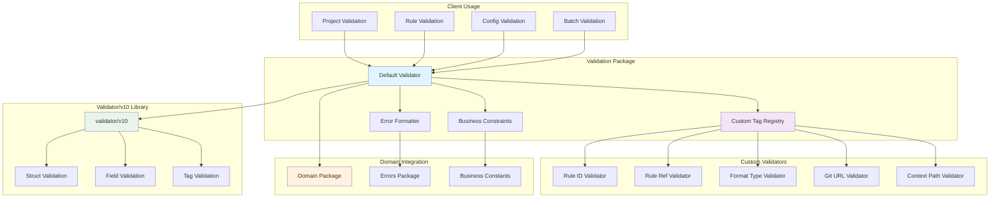
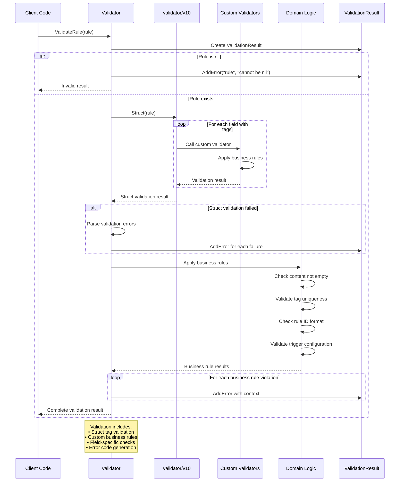
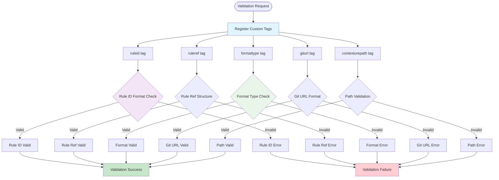

# Validation Package

This package provides centralized validation logic for all Contexture types using a consistent, robust approach built on the validator/v10 library with custom validation tags and comprehensive error formatting.

## Purpose

The validation package serves as the single source of truth for all data validation within the Contexture CLI. It ensures data integrity, provides meaningful error messages, and maintains consistent validation rules across the entire application.

## Key Features

- **Comprehensive Rule Validation**: Validates rule structure, content, metadata, and business logic constraints
- **Project Configuration Validation**: Ensures project configs are well-formed with valid formats and unique rule IDs  
- **Custom Validation Tags**: Extended validator with domain-specific tags like `ruleref`, `ruleid`, `formattype`, and `giturl`
- **Batch Processing**: Efficiently validates multiple rules with detailed result reporting
- **Context-Aware**: Supports validation with cancellation context for long-running operations
- **Structured Error Handling**: Consistent error formatting with field-specific messages and error codes

## Validation Capabilities

- **Rules**: Content validation, ID format checking, tag uniqueness, trigger configuration
- **Projects**: Format configuration validation, rule ID uniqueness, enabled format requirements
- **Rule References**: ID format and structure validation
- **Git URLs**: Repository URL format validation
- **Format Configurations**: Type validation and configuration structure

### Validation System Architecture

### Rule Validation Pipeline

### Custom Tag System

## Usage Within Project

This package is used by:
- **Project Package**: For validating project configuration files
- **Rule Package**: For rule validation and parsing operations  
- **Parser Package**: For validating parsed rule data

## API

- `NewValidator()`: Creates a new validator instance with custom tags registered
- `ValidateRule()`: Validates a single rule with detailed results
- `ValidateRules()`: Batch validates multiple rules
- `ValidateProject()`: Validates complete project configurations
- `ValidateRuleRef()`, `ValidateRuleID()`, `ValidateGitURL()`: Specific validation functions