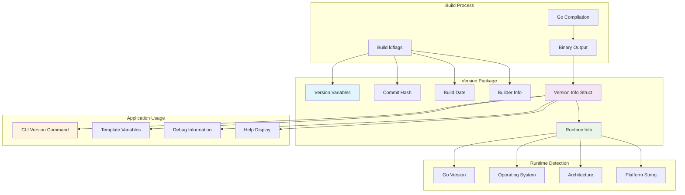
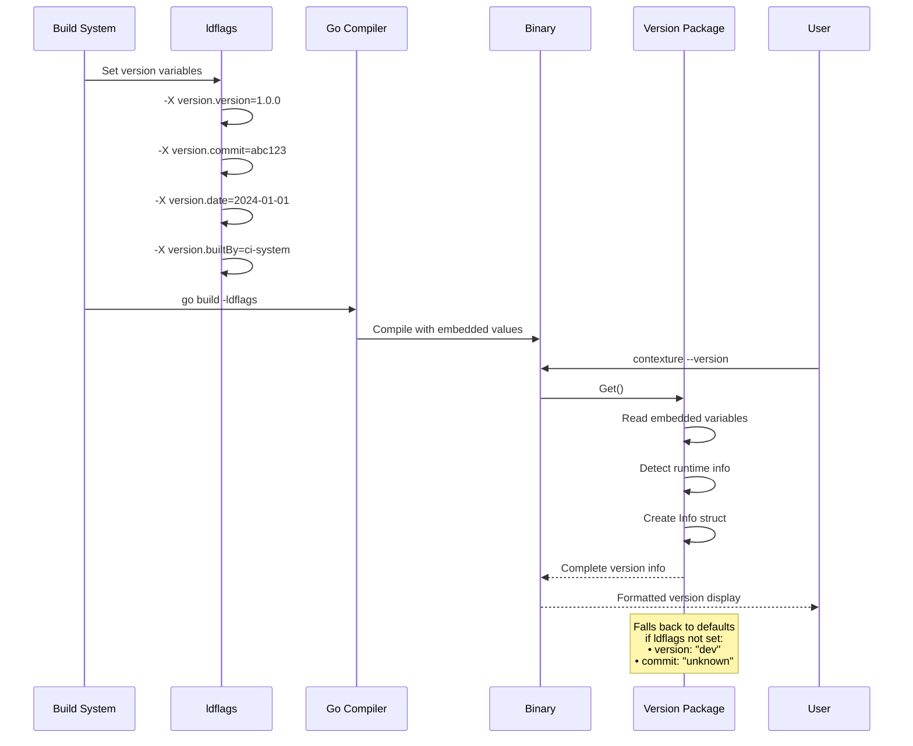

# Version Package

This package provides comprehensive build-time version information for the Contexture CLI application. It captures essential metadata about the binary including version, commit hash, build date, and runtime environment details.

## Purpose

The version package serves as the central source of truth for application versioning and build metadata. It enables the CLI to report detailed version information to users and supports debugging by providing build context.

## Key Features

- **Build-time Variables**: Version, commit hash, build date, and builder information set via ldflags during compilation
- **Runtime Information**: Automatically captures Go version and platform (OS/architecture)
- **Multiple Output Formats**: Short version string for basic usage, detailed output for comprehensive information
- **Default Fallbacks**: Graceful handling when build-time variables aren't set (defaults to "dev" and "unknown")

## Usage Within Project

This package is used by:
- **App Package**: For version commands and CLI metadata
- **Rule Variable Manager**: For template variable substitution in rules

### Version Information Flow

### Build-time Integration

## API

- `Get()`: Returns complete version information as an `Info` struct
- `GetShort()`: Returns just the version string
- `Info.String()`: Formatted version string for display
- `Info.Detailed()`: Comprehensive version information including all metadata