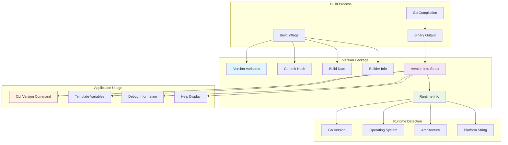
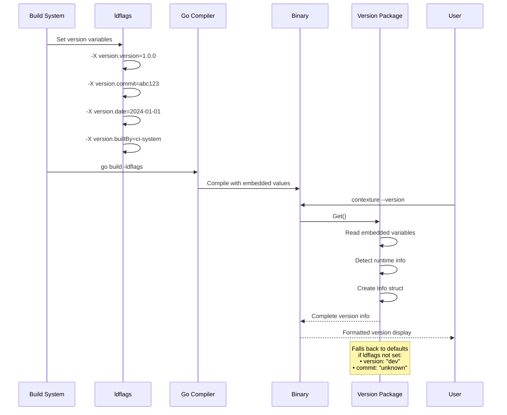

# Version Package

This package provides build-time version information for the application. It captures metadata including the version, commit hash, build date, and runtime environment details, which are embedded into the binary at compile time via `ldflags`.

## Features

- **Build-time Variables**: Captures version, commit hash, build date, and builder information.
- **Runtime Information**: Automatically includes the Go version and platform (OS/architecture).
- **Multiple Output Formats**: Provides both a short version string and a detailed output.
- **Default Fallbacks**: If build-time variables are not set, it defaults to `dev` for the version and `unknown` for other fields.

## Usage

This package is primarily used by:
- The `app` package for the `version` command and other CLI metadata.
- The rule variable manager for template variable substitution.

### Version Information Flow

### Build-time Integration

## API

- `Get() -> Info`: Returns a complete `Info` struct containing all version information.
- `GetShort() -> string`: Returns only the version string.
- `Info.String() -> string`: Returns a formatted string of the version information for display.
- `Info.Detailed() -> string`: Returns a comprehensive, multi-line string containing all version metadata.