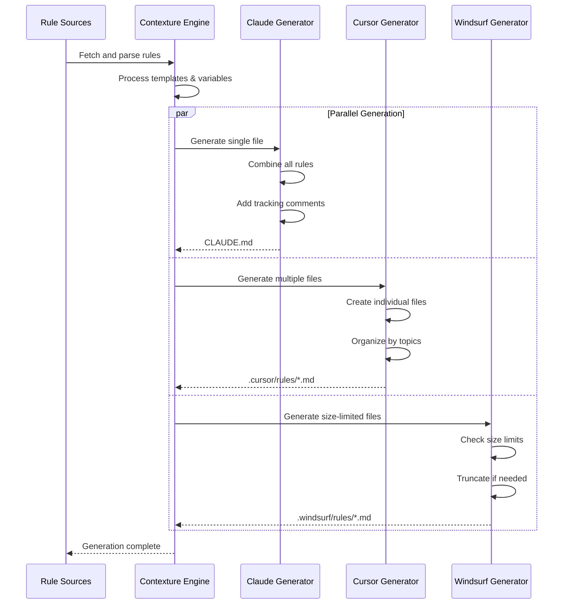

`contexture` generates format-specific files for different AI assistant platforms. Each format has unique characteristics and use cases.

## Format Overview

| Format     | Output             | Structure      | Limits                |
| :--------- | :----------------- | :------------- | :-------------------- |
| **Claude** | `CLAUDE.md`        | Single file    | None                  |
| **Cursor** | `.cursor/rules/`   | Multiple files | Per-file              |
| **Windsurf** | `.windsurf/rules/` | Multiple files | 6k per file, 12k total |

## Claude Format

The `claude` format generates a single `CLAUDE.md` file for use with the Claude AI assistant.

### File Structure

```
project-root/
├── .contexture.yaml
└── CLAUDE.md
```

### Content Format

All rules are combined into one markdown document. HTML comments are used to track the source of each rule.

```markdown
# claude.md

---

# Code Quality Guidelines

When writing code, follow these principles...

<!-- id: [contexture:code/clean-code] -->

---

# Testing Standards

Write comprehensive tests for all new functionality...

<!-- id: [contexture:testing/unit-tests] -->
```

### Configuration

```yaml
formats:
  - type: claude
    enabled: true
```

## Cursor Format

The `cursor` format generates multiple rule files in the `.cursor/rules/` directory for use with the Cursor IDE.

### File Structure

```
project-root/
├── .contexture.yaml
└── .cursor/
    └── rules/
        ├── code-quality.md
        └── testing-standards.md
```

### Content Format

Each rule is generated as a separate markdown file.

**`.cursor/rules/code-quality.md`**:
```markdown
# Code Quality Guidelines

When writing code in this project:
- Use descriptive variable names.
- Keep functions under 50 lines.

<!-- id: [contexture:code/clean-code] -->
```

### Configuration

```yaml
formats:
  - type: cursor
    enabled: true
```

## Windsurf Format

The `windsurf` format generates rule files for the Windsurf IDE.

### File Structure

```
project-root/
├── .contexture.yaml
└── .windsurf/
    └── rules/
        ├── primary-rules.md
        └── testing-rules.md
```

### Content Format

The content format is similar to the `cursor` format, but with strict size limitations. `windsurf` also supports a single-file mode, which combines all rules into one file.

### Character Limits

-   **Per File**: 6,000 characters
-   **Total**: 12,000 characters across all rule files

`contexture` automatically truncates rules that exceed these limits and warns the user.

### Configuration

```yaml
formats:
  - type: windsurf
    enabled: true
```

## Format Transformation Process



## Next Steps

-   **[Projects](./projects)**: Project organization and configuration.
-   **[Variables](./variables)**: Customizing rules with template variables.
