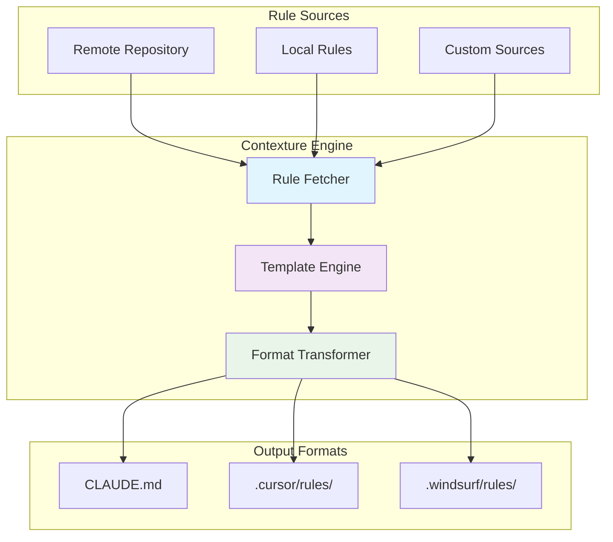
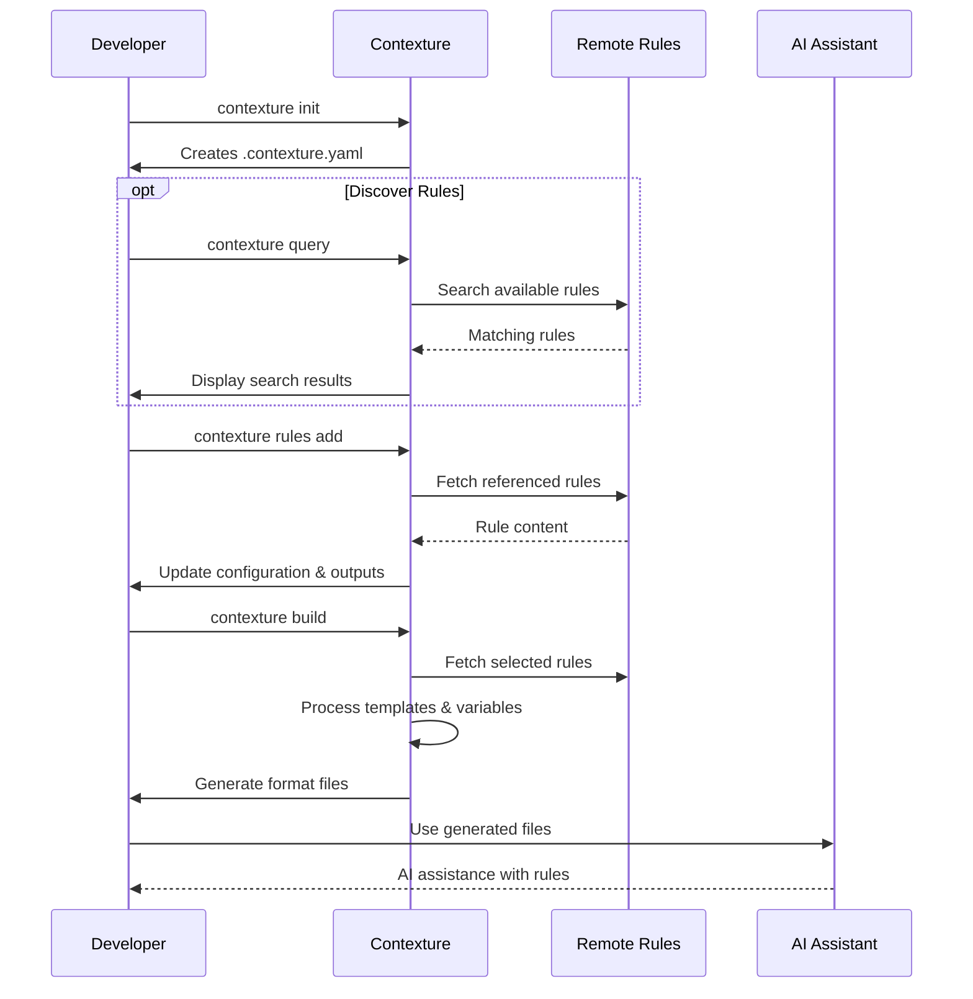

`contexture` is a command-line tool for managing AI assistant rules across multiple platforms and formats. It provides a centralized system for organizing, versioning, and deploying AI assistant instructions.

## The Problem

Development teams often use multiple AI assistant tools, such as Claude, Cursor, and Windsurf. Each tool has its own format and requirements for AI instructions, including different file structures, syntax, character limits, and variable handling.

Managing these instructions manually leads to inconsistencies, duplicated effort, and version drift.

## The Solution

`contexture` provides:

-   A **single source of truth** for rules.
-   Automatic **format translation** to platform-specific formats.
-   Access to a **rule repository** of community-maintained rules.
-   **Version management** to keep rules up-to-date.
-   A **template system** for customizing rules with variables.

## Architecture



## Key Concepts

### Rules

Rules are markdown documents that contain AI assistant instructions. They consist of:

-   **Frontmatter**: Metadata such as `title`, `description`, and `tags`.
-   **Content**: The instructions for the AI assistant.
-   **Variables**: Placeholders for dynamic values.

**Example:**
```markdown
---
title: Clean Code Principles
description: Guidelines for writing maintainable code
tags: [code-quality, best-practices]
---

When writing code, follow these principles:
- Use meaningful variable names.
- Keep functions small and focused.
```

### Projects

A `contexture` project is a directory containing a `.contexture.yaml` configuration file. This file defines:

-   Enabled output formats.
-   A list of rule references to include.
-   Custom rule sources.

### Formats

Formats are the output targets for different AI assistant platforms.

| Format   | File/Directory     |
| :------- | :----------------- |
| `claude` | `CLAUDE.md`        |
| `cursor` | `.cursor/rules/`   |
| `windsurf` | `.windsurf/rules/` |

### Sources

Sources are repositories that contain collections of rules. `contexture` supports:
- The default community-maintained rule repository.
- Custom Git repositories for private or team-specific rules.
- Local, project-specific rules.

## Workflow



A typical workflow is:
1.  **Initialize**: `contexture init` creates a project configuration file.
2.  **Discover Rules** (Optional): `contexture query` to search for available rules.
3.  **Add Rules**: `contexture rules add` to add rules from a repository.
4.  **Build**: `contexture build` generates the platform-specific output files.

## Next Steps

-   **[Rules](rules)**: The rule structure.
-   **[Formats](formats)**: Output format differences.
-   **[Projects](projects)**: Project configuration.
-   **[Variables](variables)**: Customizing rules with variables.
-   **[Commands Reference](../reference/commands/init)**: The full list of commands.
